# TÀI LIỆU THIẾT KẾ CHI TIẾT HỆ THỐNG


## (Software Design Document – SDD)


**Tên đề tài:** Xây dựng Discord Bot Quản Lý Server Tích Hợp AI  


**Nhóm thực hiện:** Nhóm 69  


**Thành viên thực hiện & Phân chia vai trò:**


- **Trần Đức Mạnh** (MSSV: [Sinh viên tự điền]) - Lead Backend Developer: Thiết kế kiến trúc Bot (Core, Event Handler, Commands), Cơ sở dữ liệu và IPC API Server Engine.


- **Đỗ Hoàng Long** (MSSV: [Sinh viên tự điền]) - PM & DevOps Specialist: Điều phối dự án, Triển khai đám mây (Render & Neon PostgreSQL), Uptime Monitoring, API Health Check.


- **Mai Văn Việt** (MSSV: [Sinh viên tự điền]) - QA & Security Engineer: Kiểm thử hộp đen/trắng, Bảo mật hệ thống, Xử lý CORS và Rate Limiting, Thiết lập kịch bản Test Cases.


- **Tống Xuân Nghĩa** (MSSV: [Sinh viên tự điền]) - UI/UX & Content Designer: Thiết kế giao diện Desktop GUI (CustomTkinter), Layout Web Dashboard, và định dạng tương tác trên Discord (Embeds, Buttons, Select Menus).


- **Nguyễn Đức Duy** (MSSV: [Sinh viên tự điền]) - AI/ML & Feature Integration: Tích hợp Gemini AI SDK, thuật toán chống Spam (Sliding Window), crawler mạng xã hội (YouTube RSS feed, Reddit JSON API, TikTok) và thuật toán tích lũy cấp bậc (Economy).


**Giảng viên hướng dẫn:** [Điền tên giảng viên]  


**Lớp / Học kỳ:** Học kỳ II - Năm học 2025-2026  


**Ngày hoàn thành:** 18 tháng 06 năm 2026  


---


## Mục Lục


1. [1. Đặt vấn đề](#1-dat-van-de)


   - [1.1. Mô tả bài toán](#11-mo-ta-bai-toan)


   - [1.2. Mô tả tổng thể sản phẩm](#12-mo-ta-tong-the-san-pham)


   - [1.3. Mục đích tài liệu](#13-muc-dich-tai-lieu)


   - [1.4. Quy ước tài liệu](#14-quy-uoc-tai-lieu)


   - [1.5. Các yêu cầu nghiệp vụ](#15-cac-yeu-cau-nghiep-vu)


   - [1.6. Yêu cầu phi nghiệp vụ](#16-yeu-cau-phi-nghiep-vu)


   - [1.7. Các kỹ thuật áp dụng để giải quyết bài toán](#17-cac-ky-thuat-ap-dung-de-giai-quyet-bai-toan)


2. [2. Phân tích nghiệp vụ](#2-phan-tich-nghiep-vu)


   - [2.1. Các lớp người dùng hệ thống](#21-cac-lop-nguoi-dung-he-thong)


   - [2.2. Các đối tác nghiệp vụ và thừa tác viên](#22-cac-doi-tac-nghiep-vu-va-thua-tac-vien)


   - [2.3. Các quy trình nghiệp vụ](#23-cac-quy-trinh-nghiep-vu)


3. [3. Phân tích yêu cầu](#3-phan-tich-yeu-cau)


   - [3.1. Xác định yêu cầu các bên liên quan](#31-xac-dinh-yeu-cau-cac-ben-lien-quan)


   - [3.2. Xác định Actor](#32-xac-dinh-actor)


   - [3.3. Sơ đồ Use Case Tổng Quan](#33-so-do-use-case-tong-quan)


   - [3.4. Đặc tả các ca sử dụng chi tiết](#34-dac-ta-cac-ca-su-dung-chi-tiet)


   - [3.5. Biểu đồ hoạt động (Activity Diagrams)](#35-bieu-do-hoat-dong-activity-diagrams)


4. [4. Thiết kế hệ thống](#4-thiet-ke-he-thong)


   - [4.1. Kiến trúc hệ thống](#41-kien-truc-he-thong)


   - [4.2. Thiết kế Class & Sequence Diagrams](#42-thiet-ke-class-sequence-diagrams)


   - [4.3. Thiết kế giao diện (UI Layout)](#43-thiet-ke-giao-dien-ui-layout)


   - [4.4. Thiết kế cơ sở dữ liệu & Mô hình ERD](#44-thiet-ke-co-so-du-lieu-mo-hinh-erd)


---


## Danh sách Hình vẽ, Sơ đồ, Bảng, Biểu đồ


- **Bảng 1:** Danh sách phân chia công việc (Task checklist) của nhóm.


- **Bảng 2:** Danh sách tóm tắt Use Cases (UC01 đến UC11).


- **Hình 3.3.1:** Sơ đồ Use Case tổng quan của Discord Bot.


- **Hình 3.5.1:** Biểu đồ hoạt động (Activity Diagram) của luồng kiểm duyệt tự động AutoMod.


- **Hình 3.5.2:** Biểu đồ hoạt động (Activity Diagram) của luồng phát nhạc Music.


- **Hình 3.5.3:** Biểu đồ hoạt động (Activity Diagram) của luồng đàm thoại AI Chatbot & Logging Token.


- **Hình 3.5.4:** Biểu đồ hoạt động của hệ thống vé hỗ trợ Ticket.


- **Hình 3.5.5:** Biểu đồ hoạt động của hệ thống tạo phòng thoại tạm thời.


- **Hình 3.5.6:** Biểu đồ hoạt động của hệ thống kinh tế Leveling & Economy.


- **Hình 3.5.7:** Biểu đồ hoạt động của hệ thống theo dõi mạng xã hội Social Tracker.


- **Hình 3.5.8:** Biểu đồ hoạt động của luồng cấu hình từ Web Dashboard.


- **Hình 4.1.1:** Sơ đồ kiến trúc phân tầng hệ thống (High-Level Architecture).


- **Hình 4.2.1:** Sơ đồ lớp (Class Diagram) cấu trúc Cogs & Services.


- **Hình 4.2.2:** Biểu đồ tuần tự (Sequence Diagram) thực hiện lệnh `/play` phát nhạc.


- **Hình 4.2.3:** Biểu đồ tuần tự (Sequence Diagram) đàm thoại và lưu lịch sử qua lệnh `/chat`.


- **Hình 4.2.4:** Biểu đồ tuần tự (Sequence Diagram) luồng kiểm duyệt tự động AutoMod (on_message → Scam → Spam → Blacklist).


- **Hình 4.2.5:** Biểu đồ tuần tự (Sequence Diagram) luồng đàm thoại AI đầy đủ (Spam Guard → RAG → Gemini → Token Logging).


- **Hình 4.4.1:** Sơ đồ mối quan hệ thực thể cơ sở dữ liệu (Entity-Relationship Diagram - ERD).


---


## Các Task đã thực hiện


Dưới đây là bảng phân chia nhiệm vụ và mức độ đóng góp của từng thành viên trong quá trình phát triển hệ thống:


| Họ và tên | Nhiệm vụ | % Đóng góp | Ghi chú |


| :--- | :--- | :--- | :--- |


| **Trần Đức Mạnh** | Lập trình bot core, cơ chế nạp/gỡ Cog, database wrapper, REST API nội bộ. | 20% | Hoàn thành đúng hạn |


| **Đỗ Hoàng Long** | DevOps, Cấu hình Render hosting & Neon Cloud PostgreSQL, Health checks, Uptime monitoring. | 20% | Hoàn thành đúng hạn |


| **Mai Văn Việt** | Thiết lập kịch bản test case, CORS, rate limiter, payload verification cho API. | 20% | Hoàn thành đúng hạn |


| **Tống Xuân Nghĩa** | Thiết kế UI admin GUI desktop (customtkinter), Web dashboard mockups, Discord Embed layouts. | 20% | Hoàn thành đúng hạn |


| **Nguyễn Đức Duy** | Tích hợp Google Gemini, sliding window anti-spam cho bot AI, Leveling Economy system, social crawler. | 20% | Hoàn thành đúng hạn |


---


## 1. Đặt vấn đề


### 1.1. Mô tả bài toán


Discord là nền tảng giao tiếp trực tuyến với hàng triệu máy chủ cộng đồng (servers) đang hoạt động cùng lúc. Việc quản lý các máy chủ này, đặc biệt là các máy chủ có quy mô từ hàng ngàn đến hàng vạn thành viên, bằng các phương pháp thủ công là một thách thức cực kỳ lớn. Quản trị viên (Admin/Moderator) thường xuyên phải đối mặt với các vấn đề nổi cộm:


- **Tập tin/Liên kết lừa đảo (Phishing/Scam):** Các bot spam tự động hoặc tài khoản bị hack liên tục gửi mã độc hại để chiếm đoạt tài khoản người dùng khác.


- **Tin nhắn rác (Spam):** Thành viên gửi tin nhắn liên tục với tốc độ cao, làm nghẽn dòng thông tin và ảnh hưởng nghiêm trọng đến trải nghiệm cộng đồng.


- **Phá hoại máy chủ (Nuking/Raiding):** Các tài khoản quản trị bị lộ token hoặc phản bội tiến hành xóa hàng loạt kênh, vai trò (roles) trong vài giây nhằm phá hủy máy chủ.


- **Tiện ích giải trí & Hỗ trợ:** Nhu cầu giải trí bằng âm nhạc chất lượng cao, hệ thống tính điểm tương tác (leveling) thúc đẩy cộng đồng hoạt động, và các kênh hỗ trợ thành viên (ticket) bảo mật.


Giải pháp đặt ra là xây dựng một hệ thống Discord Bot tự động hóa toàn diện, chạy 24/7 trên môi trường đám mây, tích hợp các cơ chế kiểm duyệt tự động dựa trên thuật toán thông minh và trí tuệ nhân tạo (AI), hỗ trợ quản trị viên cấu hình linh hoạt thông qua giao diện Web trực quan.


### 1.2. Mô tả tổng thể sản phẩm


Hệ thống **Discord Bot Quản Lý Server Tích Hợp AI** là giải pháp phần mềm toàn diện (All-in-One) bao gồm ba cấu phần cốt lõi:


1. **Core Discord Bot (Backend):** Được phát triển bằng ngôn ngữ Python sử dụng thư viện `discord.py` không đồng bộ (`asyncio`). Nó chịu trách nhiệm kết nối trực tiếp với Discord Gateway qua giao thức WebSocket để tiếp nhận, phân phối sự kiện và thực thi câu lệnh.


2. **API Server Engine (Middleware):** Chạy song song trong vòng lặp sự kiện của Bot bằng thư viện `aiohttp`. Engine này cung cấp một cổng giao tiếp HTTP REST API bảo mật nội bộ phục vụ việc kết xuất dữ liệu thống kê của máy chủ và cho phép thay đổi cấu hình nóng.


3. **Web Dashboard / Desktop GUI (Frontend):** Giao diện quản trị tối màu (Dark mode) hiện đại sử dụng Single Page Application (Web) hoặc CustomTkinter (Desktop), giúp Admin điều khiển toàn bộ hành vi của bot (bật/tắt module, cấu hình prefix, chỉnh sửa danh sách từ cấm, thay đổi prompt hệ thống cho AI) mà không cần can thiệp vào mã nguồn.


Sản phẩm hỗ trợ cấu trúc database kép: SQLite cho các nhà phát triển thử nghiệm trên máy cục bộ và PostgreSQL Serverless (Neon.tech) khi vận hành thực tế trên đám mây Render.com.


### 1.3. Mục đích tài liệu


Tài liệu này đặc tả chi tiết thiết kế hệ thống, cung cấp các sơ đồ kiến trúc logic, luồng dữ liệu nghiệp vụ, mô hình lớp đối tượng, các biểu đồ hoạt động, biểu đồ tuần tự và sơ đồ quan hệ thực thể (ERD) cơ sở dữ liệu. Tài liệu nhằm mục đích làm cẩm nang kỹ thuật cho các kỹ sư phát triển phần mềm và nhân viên kiểm thử hệ thống có thể dễ dàng nắm bắt mã nguồn, bảo trì và mở rộng hệ thống bot.


### 1.4. Quy ước tài liệu


- **Bot/System:** Hệ thống Discord Bot quản lý tích hợp AI do nhóm phát triển.


- **Guild/Server:** Máy chủ Discord, đơn vị phân vùng quản lý chính của Discord.


- **Cog:** Plugin/Module nghiệp vụ được cấu trúc tách biệt trong kiến trúc của `discord.py` (Ví dụ: Music Cog, Moderation Cog).


- **AutoMod:** Cơ chế lọc và xử lý nội dung vi phạm tự động mà không cần sự can thiệp của con người.


- **IPC (Inter-Process Communication):** Cơ chế truyền thông điệp giữa tiến trình Bot Core và Frontend Dashboard.


- **RAG (Retrieval-Augmented Generation):** Kỹ thuật truy xuất thông tin từ tài liệu văn bản (luật lệ server) làm ngữ cảnh bổ trợ cho AI Gemini sinh câu trả lời chính xác.


### 1.5. Các yêu cầu nghiệp vụ


#### 1.5.1. Nhóm chức năng Kiểm duyệt và Quản trị (Moderation)


- **Tự động kiểm duyệt (AutoMod):** Quét thời gian thực tất cả tin nhắn trên các kênh chat công cộng. Nếu phát hiện liên kết Phishing/Scam, từ cấm trong Blacklist, hoặc hành vi spam tin nhắn, hệ thống lập tức xóa tin nhắn đó, ghi nhận nhật ký (Log) và tự động áp dụng hình phạt cấm ngôn (Timeout) hoặc cấm tham gia (Ban) tùy mức độ vi phạm.


- **Chống phá hoại (Anti-Nuke):** Giám sát tần suất các hành động nhạy cảm như xóa kênh, xóa vai trò của các quản trị viên cấp dưới. Nếu một tài khoản thực hiện vượt quá 3 hành động trong vòng 30 giây, bot sẽ tự động thu hồi toàn bộ quyền hạn (Role) của tài khoản đó để bảo vệ server.


- **Quản trị thủ công:** Admin/Moderator sử dụng các slash commands (`/kick`, `/ban`, `/mute`, `/warn`, `/unban`) để xử lý các đối tượng quấy rối nhanh chóng.


#### 1.5.2. Nhóm chức năng Tiện ích cộng đồng (Utilities)


- **Hệ thống hỗ trợ (Ticket System):** Cho phép thành viên nhấn nút tạo một kênh trò chuyện riêng tư với Ban quản lý. Toàn bộ nội dung trao đổi sẽ được lưu trữ lại khi đóng Ticket.


- **Tạo kênh thoại tạm thời (Voice Generator):** Khi thành viên tham gia vào phòng chờ chỉ định, bot sẽ tự động tạo một phòng thoại mới cho thành viên đó và tự động xóa phòng thoại này đi khi không còn ai bên trong.


- **Tự nhận vai trò (Reaction Roles):** Cung cấp các panel có nút bấm tương tác (Button) giúp thành viên tự do chọn lựa hoặc gỡ bỏ các vai trò tùy thích (như thông báo, giới tính, khu vực) mà không cần liên hệ Admin.


#### 1.5.3. Nhóm chức năng Giải trí và Tương tác (Entertainment & AI)


- **Phát nhạc (Music Player):** Stream trực tiếp âm thanh chất lượng cao từ YouTube hoặc SoundCloud vào kênh thoại. Hỗ trợ đầy đủ các tính năng: hàng đợi bài hát, trộn bài (Shuffle), tạm dừng (Pause), tua bài (Skip) và bảng điều khiển trực quan dạng Button đính kèm dưới Embed. Hệ thống có tính năng AutoPlay tự tìm kiếm bài hát tương tự khi hết hàng đợi.


- **Kinh tế & Cấp độ (Leveling & Economy):** Thành viên khi nhắn tin sẽ nhận được điểm kinh nghiệm (XP) ngẫu nhiên theo thời gian thực (cooldown 60 giây để chống spam XP). Khi đạt đủ XP, thành viên sẽ thăng cấp (Level Up) và nhận được thẻ Rank Card dạng hình ảnh tự động tạo bởi thư viện Pillow.


- **Chatbot AI đàm thoại (Gemini AI):** Tích hợp Google Gemini API cho phép trò chuyện tự nhiên với Bot thông qua một kênh chỉ định hoặc qua tag mention `@Bot`. Bot có khả năng ghi nhớ lịch sử hội thoại lên đến 20 tin nhắn gần nhất và tích hợp RAG để đọc hiểu luật lệ của server từ tệp tin `server_rules.txt` nhằm giải đáp thắc mắc cho người dùng.


#### 1.5.4. Nhóm chức năng Theo dõi và Cấu hình (System)


- **Theo dõi mạng xã hội (Social Tracker):** Quét định kỳ mỗi 5 phút một lần nguồn tin của các kênh YouTube (qua RSS Feed), Reddit (qua JSON API), TikTok để tự động gửi thông báo kèm liên kết và tag vai trò khi có video hoặc bài viết mới.


- **Web Dashboard:** Trang quản trị trung tâm dành cho Admin, hiển thị biểu đồ tài nguyên hệ thống và cho phép sửa đổi prefix của bot, cấu hình API keys, chỉnh sửa danh mục từ cấm hoặc xem lịch sử trò chuyện AI.


### 1.6. Yêu cầu phi nghiệp vụ


- **1.6.1. Hiệu năng:** Thời gian phản hồi đối với các lệnh thông thường phải dưới 500ms. Đối với các lệnh tương tác API ngoài (như tải nhạc YouTube hoặc gọi Gemini AI), bot phải gửi trạng thái trì hoãn (`defer`) để tránh bị Discord báo lỗi hết hạn kết nối (3 giây).


- **1.6.2. Tính sẵn sàng (Uptime):** Hệ thống đạt mức hoạt động liên tục 99%. Bot được docker hóa hoặc Nixpacks đóng gói để triển khai lên Render Cloud, có khả năng tự động restart khi gặp sự cố crash. UptimeRobot được cấu hình gửi yêu cầu định kỳ đến API `/health` để giữ bot không bị chuyển sang trạng thái ngủ (idle sleep).


- **1.6.3. Bảo mật:** Token Discord, API Key của Gemini tuyệt đối không được viết cứng trong mã nguồn, phải được cấu hình qua biến môi trường trong file `.env`. API Server nội bộ bắt buộc phải xác thực thông qua Header `X-API-Key` và hỗ trợ kiểm tra CORS cùng cơ chế giới hạn tần suất yêu cầu (Rate Limiter: tối đa 30 requests/phút từ cùng một IP).


- **1.6.4. Khả năng mở rộng:** Áp dụng mô hình Plugin kiến trúc Cog. Mỗi tính năng là một tệp Python độc lập kế thừa lớp `commands.Cog`. Khi thêm tính năng mới, chỉ cần đặt tệp tin vào thư mục `cogs/` và gọi lệnh nạp mà không cần sửa đổi nhân Bot Core.


- **1.6.5. Khả năng tương thích:** Tầng cơ sở dữ liệu trừu tượng hóa các câu lệnh SQL giúp bot tương thích hoàn toàn với cả SQLite (khi chạy local thử nghiệm) và PostgreSQL (khi chạy thực tế trên máy chủ Neon Cloud).


### 1.7. Các kỹ thuật áp dụng để giải quyết bài toán


- **Kiến trúc Hướng sự kiện (Event-Driven):** Tận dụng tối đa mô hình lập trình không đồng bộ với từ khóa `async/await` và vòng lặp sự kiện `asyncio` để xử lý hàng ngàn sự kiện WebSocket từ Discord đồng thời mà không nghẽn luồng.


- **Sliding Window Algorithm:** Áp dụng để phát hiện spam tin nhắn và theo dõi tần suất chống phá hoại (Anti-Nuke). Một danh sách các mốc thời gian (timestamps) của người dùng được lưu trữ và lọc liên tục trong một cửa sổ trượt (ví dụ: 3.5 giây đối với spam tin nhắn và 30 giây đối với Anti-Nuke) để đếm số lượng vi phạm.


- **Regular Expressions (Regex):** Sử dụng biểu thức chính quy tối ưu hóa để quét nhanh các chuỗi văn bản nhằm phát hiện các tên miền lừa đảo phổ biến (`discord.gift`, `free nitro`, `steamcommunity.*free`, v.v.).


- **Dual Database Adapter Pattern:** Xây dựng một lớp proxy trung gian trong `core/database.py`. Nếu biến môi trường `DATABASE_URL` tồn tại, proxy sẽ khởi tạo kết nối Pool PostgreSQL qua thư viện `psycopg2` và tự động ánh xạ, chuyển dịch cú pháp truy vấn SQL (ví dụ: chuyển từ dấu hỏi `?` của SQLite sang `%s` của PostgreSQL và xử lý cú pháp `INSERT OR REPLACE` sang `ON CONFLICT DO UPDATE`).


---


## 2. Phân tích nghiệp vụ


### 2.1. Các lớp người dùng hệ thống


1. **Member (Thành viên phổ thông):**


   - Đọc, viết tin nhắn trên các kênh chat được cho phép.


   - Sử dụng các slash commands giải trí: `/play`, `/ask`, `/clear_history`, `/rank`.


   - Tham gia phòng thoại tạm thời, tương tác nút bấm để nhận vai trò tự động hoặc mở ticket hỗ trợ.


2. **Moderator / Admin (Ban quản trị):**


   - Thực thi các lệnh cấm, đuổi, phạt cảnh cáo thành viên vi phạm.


   - Tạo các panel Reaction Role, panel Ticket.


   - Truy cập giao diện GUI Desktop hoặc Web Dashboard bằng mật khóa an toàn để bật/tắt module và cấu hình hệ thống.


3. **System (Tiến trình tự động):**


   - Hoạt động ngầm để phân tích tin nhắn, phát hiện spam, crawler thông tin mạng xã hội, quét kiểm tra dọn dẹp các vai trò tạm thời hết hạn.


### 2.2. Các đối tác nghiệp vụ và thừa tác viên


- **Discord Developer Portal & Gateway API:** Cung cấp hạ tầng WebSocket và API REST giúp bot nhận và gửi thông điệp tới người dùng.


- **Google Generative AI Studio (Gemini API):** Đối tác cung cấp dịch vụ trí tuệ nhân tạo, tiếp nhận lời nhắc (prompt) và hình ảnh (Vision) để sinh nội dung đàm thoại.


- **YouTube Audio stream (yt-dlp):** Bộ công cụ tải và trích xuất luồng âm thanh trực tiếp từ YouTube phục vụ module âm nhạc.


- **Neon Serverless PostgreSQL:** Hệ quản trị cơ sở dữ liệu trên cloud lưu trữ lâu dài thông tin người dùng, token và cấu hình.


### 2.3. Các quy trình nghiệp vụ


#### 2.3.1. Quy trình dành cho Member


##### 2.3.1.1. Quy trình Yêu cầu Hỗ trợ (Tạo Ticket)


```


[Thành viên] ---> [Nhấn nút "Tạo Ticket"] ---> [Bot kiểm tra trạng thái Ticket của user]


                                                       |


   +----------------- (Đã có Ticket mở) <--------------+-------------> (Chưa có Ticket nào)


   |                                                                          |


[Gửi thông báo lỗi]                                              [Tạo kênh chat ẩn ticket-<username>]


                                                                              |


                                                                 [Tag Admin & Người dùng vào kênh]


                                                                              |


                                                                 [Trao đổi & Giải quyết vấn đề]


                                                                              |


                                                                 [Admin nhấn nút "Đóng Ticket"]


                                                                              |


                                                                 [Bot lưu log & Xóa kênh chat]


```


##### 2.3.1.2. Quy trình Trò chuyện cùng AI


```


[Thành viên] ---> [Gõ lệnh /ask <câu hỏi> hoặc Chat trong kênh chỉ định]


                        |


                        v


          [Bot gửi trạng thái "Typing..."]


                        |


                        v


   [RAG: Quét docs/server_rules.txt tìm luật lệ] ---> [Gộp ngữ cảnh bổ trợ]


                                                             |


                                                             v


                                             [Gọi Gemini API sinh câu trả lời]


                                                             |


                                                             v


                                            [Nhận kết quả văn bản & Token dùng]


                                                             |


                                                             v


                                             [Lưu lịch sử đàm thoại vào DB]


                                                             |


                                                             v


                                             [Lưu log Token tiêu thụ vào DB]


                                                             |


                                                             v


                                          [Trả lời thành viên (cắt nhỏ nếu >2000 kí tự)]


```


#### 2.3.2. Quy trình dành cho System (Hệ thống ngầm)


##### 2.3.2.1. Quy trình Kiểm duyệt Nội dung (AutoMod)


```


[Tin nhắn từ kênh chat] ---> [Kiểm tra có phải từ Bot hoặc Admin?] 


                                    |


            +----- (Đúng) ----------+---------- (Sai) -----+


            |                                             |


        [Bỏ qua]                                [Quét qua SCAM_REGEX]


                                                          |


                 +---- (Khớp Scam link) ------------------+---- (Không khớp) ----+


                 |                                                               |


    [Xóa tin + Ban/Timeout 1h + Log]                                  [Quét Blacklist từ cấm]


                                                                                 |


                          +---- (Khớp từ cấm) -----------------------------------+---- (Không khớp) ----+


                          |                                                                     |


             [Xóa tin + Cảnh cáo + Log]                                                 [Quét Spam Sliding Window]


                                                                                                |


                                       +---- (>5 tin/3.5 giây) ---------------------------------+---- (Không khớp)


                                       |                                                                 |


                           [Xóa các tin + Timeout 5m + Log]                                      [Lưu và hiển thị tin]


```


---


## 3. Phân tích yêu cầu


### 3.1. Xác định yêu cầu các bên liên quan


- **Về phía Admin/Moderator:** Yêu cầu một hệ thống bảo vệ toàn diện chống phá hoại, dễ dàng kiểm soát, cấu hình đơn giản mà không cần khởi động lại bot. Hệ thống phải phản hồi trạng thái hoạt động tức thì.


- **Về phía Thành viên:** Nhu cầu chơi nhạc ổn định, không giật lag, AI trả lời thông minh, đúng trọng tâm quy tắc máy chủ.


- **Về phía Nhà trường/Giảng viên:** Cần minh chứng rõ ràng về kiến trúc, lớp đối tượng, kiểm thử an toàn, phân chia công việc nhóm đồng đều và báo cáo thiết kế trực quan.


### 3.2. Xác định Actor


Hệ thống gồm 3 tác nhân chính:


- **Member (Thành viên):** Tác nhân kích hoạt các tiến trình giải trí, tiện ích, đàm thoại.


- **Admin/Mod (Quản trị viên):** Tác nhân thiết lập hệ thống, thực thi kỷ luật và truy cập dashboard cấu hình.


- **System (Hệ thống bot):** Tác nhân chạy nền tự động xử lý kiểm duyệt nội dung, dọn dẹp các vai trò quá hạn, crawl tin tức mạng xã hội.


### 3.3. Sơ đồ Use Case Tổng Quan


Sơ đồ Use Case thể hiện các mối quan hệ tương tác của các tác nhân (Actors) đối với các chức năng chính của hệ thống. 


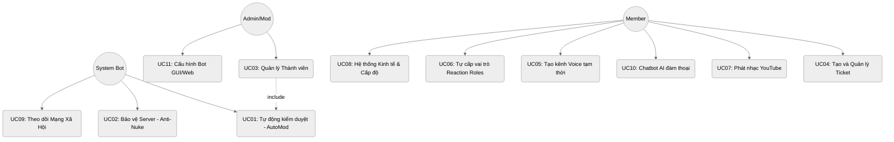
```mermaid


%%{init: {'theme': 'neutral'}}%%


graph TD


    user((Member))


    admin((Admin/Mod))


    bot((System Bot))


    user --> UC04(UC04: Tạo và Quản lý Ticket)


    user --> UC07(UC07: Phát nhạc YouTube)


    user --> UC10(UC10: Chatbot AI đàm thoại)


    user --> UC05(UC05: Tạo kênh Voice tạm thời)


    user --> UC06(UC06: Tự cấp vai trò Reaction Roles)


    user --> UC08(UC08: Hệ thống Kinh tế & Cấp độ)


    admin --> UC03(UC03: Quản lý Thành viên)


    admin --> UC11(UC11: Cấu hình Bot GUI/Web)


    bot --> UC01(UC01: Tự động kiểm duyệt - AutoMod)


    bot --> UC02(UC02: Bảo vệ Server - Anti-Nuke)


    bot --> UC09(UC09: Theo dõi Mạng Xã Hội)


    UC03 -.->|include| UC01


```


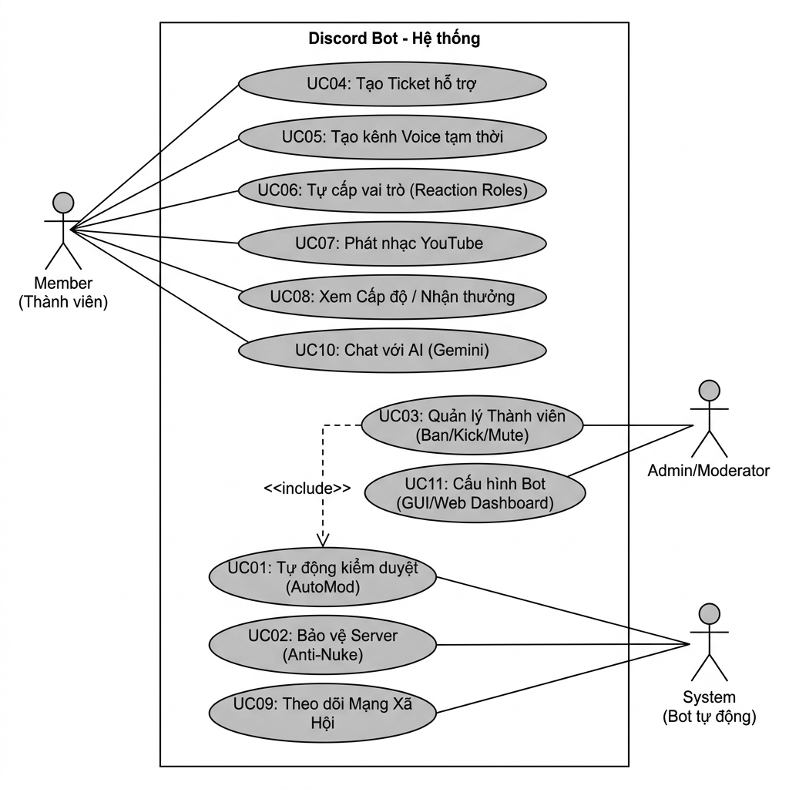


### 3.4. Đặc tả các ca sử dụng chi tiết


Dưới đây là bảng đặc tả chi tiết của 5 ca sử dụng cốt lõi nhất của hệ thống:


#### 3.4.1. Đặc tả UC01: Tự động kiểm duyệt (AutoMod)


| Thuộc tính | Chi tiết |


| :--- | :--- |


| **Tên Use Case** | Tự động kiểm duyệt (AutoMod) |


| **Tác nhân** | System (Hệ thống) |


| **Mô tả** | Hệ thống tự động quét và phân tích tin nhắn thời gian thực để xóa các link scam, spam hoặc từ khóa blacklist, đồng thời phạt người vi phạm. |


| **Tiền điều kiện** | Bot có quyền "Manage Messages", "Timeout Members". Module AutoMod được bật. |


| **Hậu điều kiện** | Tin nhắn vi phạm bị xóa. Người dùng bị cảnh cáo, timeout hoặc ban; nhật ký vi phạm ghi vào database. |


| **Luồng sự kiện chính** | 1. Người dùng gửi tin nhắn vào kênh chat.<br>2. System bắt sự kiện `on_message` và kiểm tra tin nhắn.<br>3. Kiểm tra scam link bằng biểu thức chính quy (Regex).<br>4. Kiểm tra từ khóa trong Blacklist database.<br>5. Kiểm tra tần suất tin nhắn (Sliding Window).<br>6. Cho phép hiển thị nếu tin nhắn hợp lệ. |


| **Luồng ngoại lệ** | - **3a. Khớp Scam link:** System xóa tin nhắn, timeout tài khoản 1 giờ và ghi Log.<br>- **4a. Khớp từ cấm:** System xóa tin nhắn, tăng số lần Warn trong DB, ghi Log.<br>- **5a. Phát hiện Spam:** System xóa các tin nhắn trùng lặp, timeout 5 phút, ghi Log. |


#### 3.4.2. Đặc tả UC04: Tạo và Quản lý Ticket


| Thuộc tính | Chi tiết |


| :--- | :--- |


| **Tên Use Case** | Tạo và Quản lý Ticket |


| **Tác nhân** | Member (Chính), Admin (Phụ) |


| **Mô tả** | Cho phép thành viên tạo kênh chat hỗ trợ riêng tư trực tiếp với ban quản trị. |


| **Tiền điều kiện** | Bot được cấp quyền tạo và phân quyền kênh chat. Panel tạo ticket đã được gửi ở kênh hỗ trợ. |


| **Hậu điều kiện** | Một kênh chat được tạo ra, chỉ có thành viên đó và Admin nhìn thấy. |


| **Luồng sự kiện chính** | 1. Member click nút "Tạo Ticket" trên panel.<br>2. Bot kiểm tra xem Member đã có Ticket nào đang mở chưa.<br>3. Tạo kênh chat văn bản mới tên `ticket-<tên-user>`.<br>4. Cấp quyền đọc/ghi cho Member và Admin, chặn quyền đọc của các thành viên khác.<br>5. Gửi tin nhắn Embed chào mừng và hướng dẫn trao đổi.<br>6. Admin giải quyết xong yêu cầu hỗ trợ, click nút "Đóng Ticket" để dọn dẹp. |


| **Luồng ngoại lệ** | - **2a. Đã có Ticket đang mở:** Bot gửi thông báo dạng ẩn báo lỗi và từ chối tạo thêm kênh. |


#### 3.4.3. Đặc tả UC07: Phát nhạc YouTube


| Thuộc tính | Chi tiết |


| :--- | :--- |


| **Tên Use Case** | Phát nhạc YouTube |


| **Tác nhân** | Member |


| **Mô tả** | Kết nối Bot vào kênh thoại của người dùng và phát âm thanh từ liên kết hoặc từ khóa tìm kiếm trên YouTube. |


| **Tiền điều kiện** | Thành viên đang ở trong một kênh thoại của máy chủ. Bot có quyền Connect và Speak. |


| **Hậu điều kiện** | Bot tham gia phòng thoại, phát nhạc và gửi bảng điều khiển tương tác. |


| **Luồng sự kiện chính** | 1. Member gõ slash command `/play <link/từ khóa>`.<br>2. Bot xác thực người dùng đang ở trong kênh thoại.<br>3. Bot thực hiện kết nối vào kênh thoại đó.<br>4. Gọi thư viện `yt-dlp` phân tích, trích xuất luồng âm thanh trực tiếp.<br>5. Đưa thông tin bài hát vào hàng đợi (Queue).<br>6. Nếu bot đang rảnh, phát nhạc ngay lập tức qua tiến trình FFmpeg.<br>7. Gửi tin nhắn đính kèm Embed và các nút điều khiển nhạc (Tạm dừng, Bỏ qua, Tắt nhạc, Xáo bài, Xem hàng đợi, AutoPlay). |


| **Luồng ngoại lệ** | - **2a. Người dùng chưa vào voice:** Bot báo lỗi yêu cầu kết nối phòng thoại.<br>- **4a. Lỗi trích xuất nhạc:** Báo lỗi link không hợp lệ hoặc bị chặn bản quyền. |


#### 3.4.4. Đặc tả UC10: Chatbot AI đàm thoại (Gemini API)


| Thuộc tính | Chi tiết |


| :--- | :--- |


| **Tên Use Case** | Chatbot AI đàm thoại |


| **Tác nhân** | Member |


| **Mô tả** | Người dùng trò chuyện, hỏi đáp kiến thức hoặc tra cứu quy định server bằng ngôn ngữ tự nhiên với Bot AI. |


| **Tiền điều kiện** | Biến môi trường `GEMINI_API_KEY` hợp lệ. Tệp tin `docs/server_rules.txt` có dữ liệu. |


| **Hậu điều kiện** | Người dùng nhận được câu trả lời bằng ngôn ngữ tự nhiên; Token và lịch sử được ghi nhận trong DB. |


| **Luồng sự kiện chính** | 1. Member chat trong kênh chỉ định hoặc tag `@Bot <câu hỏi>`.<br>2. Bot hiển thị trạng thái "Đang soạn tin..." (`typing`).<br>3. Bot truy vấn RAG để lọc ra tối đa 2 mục quy tắc liên quan từ `server_rules.txt`.<br>4. Bot tải lịch sử chat của user này trong DB lên (tối đa 20 tin nhắn).<br>5. Gửi gói dữ liệu (Prompt + Ngữ cảnh luật + Lịch sử) sang Google Gemini API.<br>6. Nhận kết quả và ghi nhận số lượng Token tiêu thụ vào bảng `ai_token_usage`.<br>7. Ghi nhận nội dung câu hỏi/câu trả lời vào bảng `ai_conversations`.<br>8. Trả lời người dùng trên Discord. |


| **Luồng ngoại lệ** | - **5a. API quá tải hoặc lỗi kết nối mạng:** Bot gửi tin nhắn báo lỗi kết nối và xin lỗi người dùng. |


#### 3.4.5. Đặc tả UC11: Cấu hình Bot qua Web Dashboard


| Thuộc tính | Chi tiết |


| :--- | :--- |


| **Tên Use Case** | Cấu hình Bot qua Web Dashboard |


| **Tác nhân** | Admin |


| **Mô tả** | Quản trị viên đăng nhập giao diện web để điều khiển thiết lập cấu hình của bot theo thời gian thực. |


| **Tiền điều kiện** | API Server của Bot đang hoạt động. Quản trị viên sở hữu mã khóa xác thực API Key. |


| **Hậu điều kiện** | Thiết lập cấu hình được thay đổi tức thì trong `config.json` mà không cần khởi động lại Bot. |


| **Luồng sự kiện chính** | 1. Admin mở Web Dashboard, nhập API Key xác thực truy cập.<br>2. Dashboard gọi API `GET_CONFIG` để lấy thông số cấu hình hiện tại.<br>3. Admin thay đổi thông số trên giao diện (Ví dụ: đổi Prefix từ `!` sang `?`, sửa Prompt hệ thống).<br>4. Admin bấm nút "Lưu cấu hình".<br>5. Dashboard gửi yêu cầu `UPDATE_CONFIG` kèm payload dữ liệu tới API Server.<br>6. Bot nhận yêu cầu, cập nhật file `config.json` và làm mới biến config toàn cục tức thời.<br>7. Hiển thị thông báo lưu thành công trên Dashboard. |


| **Luồng ngoại lệ** | - **1a. Sai khóa xác thực:** Trả về lỗi 401 Unauthorized và từ chối xử lý request.<br>- **5a. Mất kết nối API:** Hiển thị thông báo mất kết nối tới Backend Bot. |


---


### 3.5. Biểu đồ hoạt động (Activity Diagrams)


Các biểu đồ hoạt động dưới đây được chuẩn hóa theo định dạng đơn sắc chuyên nghiệp để biểu diễn logic xử lý bên trong hệ thống.


#### 3.5.1. Luồng AutoMod (Kiểm duyệt tự động)


Biểu đồ mô tả quy trình tiếp nhận tin nhắn và phân tích qua các bộ lọc vi phạm:


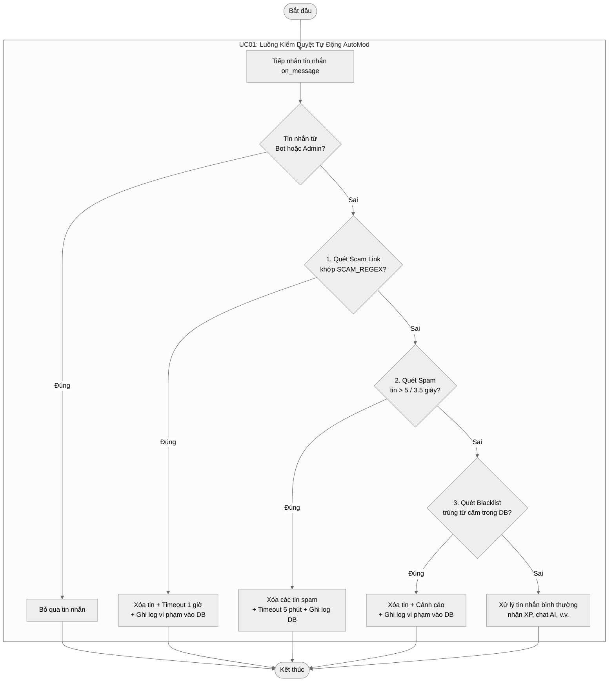
```mermaid

%%{init: {'theme': 'neutral'}}%%

flowchart TD

    Start([Bắt đầu]) --> RecvMsg[Tiếp nhận tin nhắn on_message]

    

    subgraph UC01[UC01: Luồng Kiểm Duyệt Tự Động AutoMod]

        RecvMsg --> CheckAuthor{Tin nhắn từ<br>Bot hoặc Admin?}

        

        CheckAuthor -- Đúng --> Ignore[Bỏ qua tin nhắn]

        CheckAuthor -- Sai --> FilterScam{1. Quét Scam Link<br>khớp SCAM_REGEX?}

        

        FilterScam -- Đúng --> ActionScam[Xóa tin + Timeout 1 giờ<br>+ Ghi log vi phạm vào DB]

        FilterScam -- Sai --> FilterSpam{2. Quét Spam<br>tin > 5 / 3.5 giây?}

        

        FilterSpam -- Đúng --> ActionSpam[Xóa các tin spam<br>+ Timeout 5 phút + Ghi log DB]

        FilterSpam -- Sai --> FilterBlacklist{3. Quét Blacklist<br>trùng từ cấm trong DB?}

        

        FilterBlacklist -- Đúng --> ActionWord[Xóa tin + Cảnh cáo<br>+ Ghi log vi phạm vào DB]

        FilterBlacklist -- Sai --> NormalProcess[Xử lý tin nhắn bình thường<br>nhận XP, chat AI, v.v.]

    end


    Ignore --> End([Kết thúc])

    ActionScam --> End

    ActionSpam --> End

    ActionWord --> End

    NormalProcess --> End

```


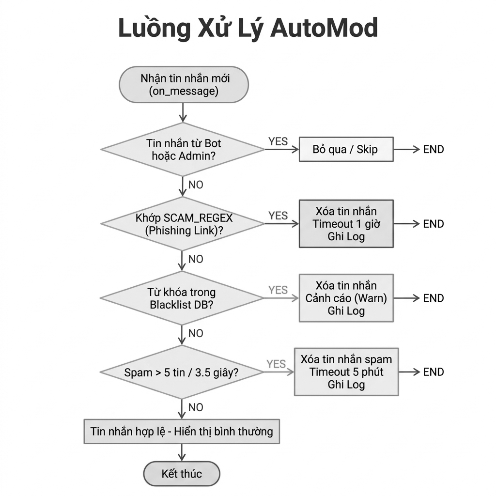


#### 3.5.2. Luồng Phát nhạc YouTube


Biểu đồ mô tả quy trình tiếp nhận bài hát và quản lý hàng đợi phát:


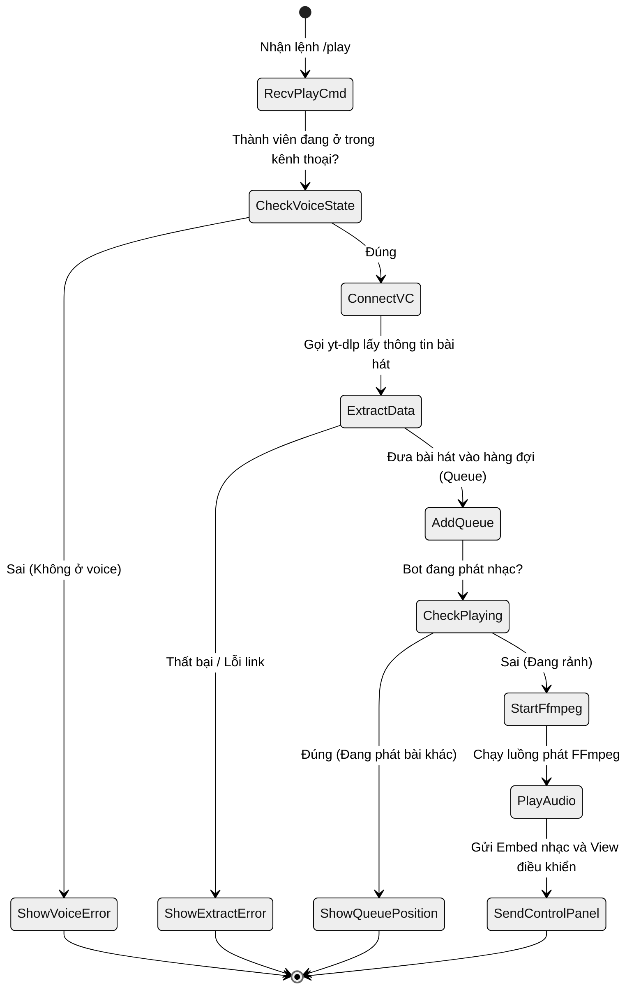
```mermaid


%%{init: {'theme': 'neutral'}}%%


stateDiagram-v2


    [*] --> RecvPlayCmd : Nhận lệnh /play <search>


    RecvPlayCmd --> CheckVoiceState : Thành viên đang ở trong kênh thoại?


    CheckVoiceState --> ShowVoiceError : Sai (Không ở voice)


    ShowVoiceError --> [*]


    


    CheckVoiceState --> ConnectVC : Đúng


    ConnectVC --> ExtractData : Gọi yt-dlp lấy thông tin bài hát


    ExtractData --> ShowExtractError : Thất bại / Lỗi link


    ShowExtractError --> [*]


    


    ExtractData --> AddQueue : Đưa bài hát vào hàng đợi (Queue)


    AddQueue --> CheckPlaying : Bot đang phát nhạc?


    


    CheckPlaying --> ShowQueuePosition : Đúng (Đang phát bài khác)


    ShowQueuePosition --> [*]


    


    CheckPlaying --> StartFfmpeg : Sai (Đang rảnh)


    StartFfmpeg --> PlayAudio : Chạy luồng phát FFmpeg


    PlayAudio --> SendControlPanel : Gửi Embed nhạc và View điều khiển


    SendControlPanel --> [*]


```


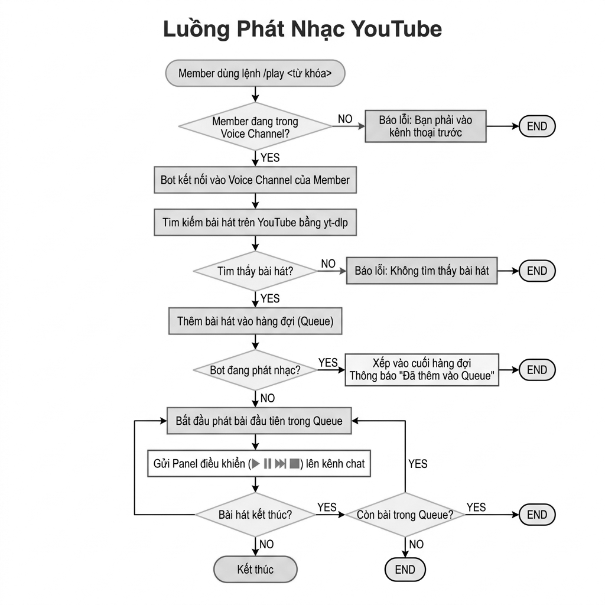


#### 3.5.3. Luồng Xử lý AI Chatbot & Logging Token


Biểu đồ mô tả tiến trình nhận câu hỏi, xử lý ngữ cảnh, truy vấn Gemini API và ghi nhận tài nguyên:


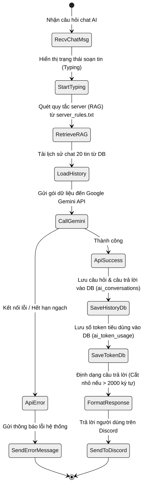
```mermaid


%%{init: {'theme': 'neutral'}}%%


stateDiagram-v2


    [*] --> RecvChatMsg : Nhận câu hỏi chat AI


    RecvChatMsg --> StartTyping : Hiển thị trạng thái soạn tin (Typing)


    StartTyping --> RetrieveRAG : Quét quy tắc server (RAG) từ server_rules.txt


    RetrieveRAG --> LoadHistory : Tải lịch sử chat 20 tin từ DB


    LoadHistory --> CallGemini : Gửi gói dữ liệu đến Google Gemini API


    


    CallGemini --> ApiError : Kết nối lỗi / Hết hạn ngạch


    ApiError --> SendErrorMessage : Gửi thông báo lỗi hệ thống


    SendErrorMessage --> [*]


    


    CallGemini --> ApiSuccess : Thành công


    ApiSuccess --> SaveHistoryDb : Lưu câu hỏi & câu trả lời vào DB (ai_conversations)


    SaveHistoryDb --> SaveTokenDb : Lưu số token tiêu dùng vào DB (ai_token_usage)


    SaveTokenDb --> FormatResponse : Định dạng câu trả lời (Cắt nhỏ nếu > 2000 ký tự)


    FormatResponse --> SendToDiscord : Trả lời người dùng trên Discord


    SendToDiscord --> [*]


```


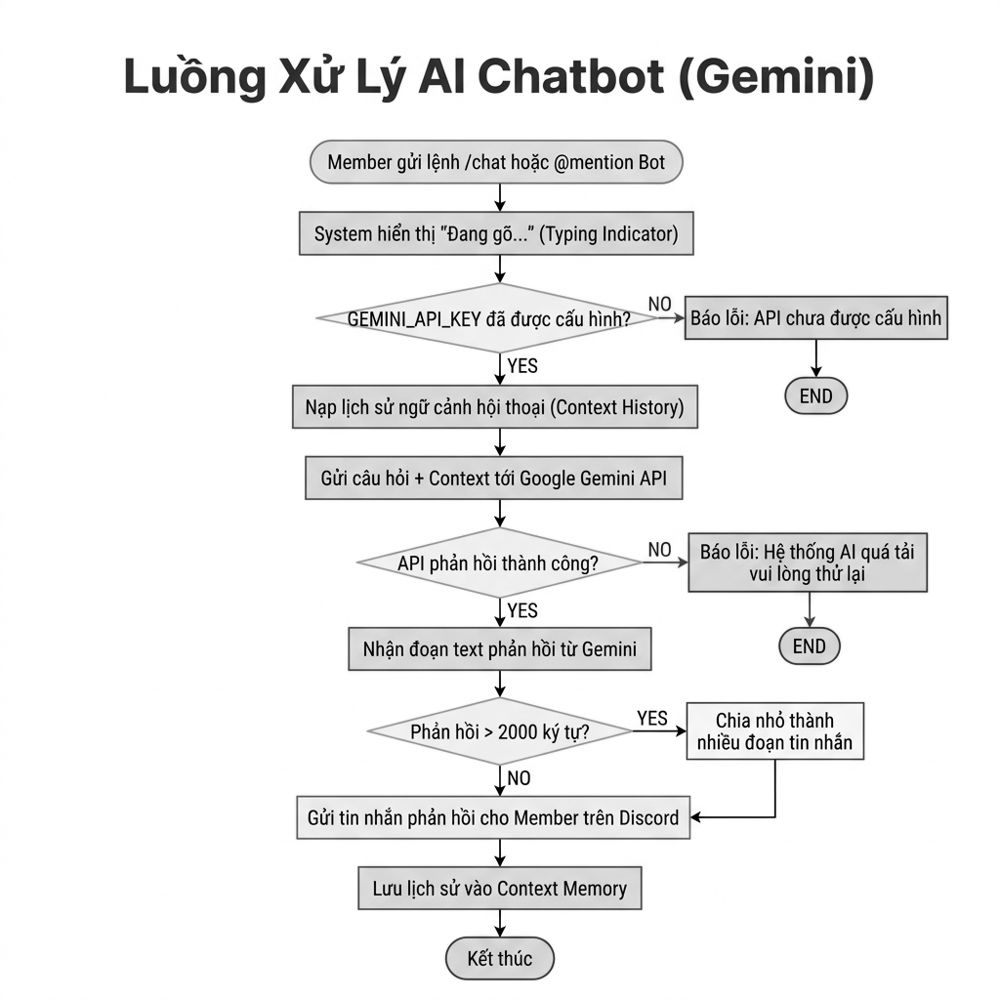


#### 3.5.4. Luồng Hệ thống Vé Hỗ Trợ (Ticket System)


Biểu đồ mô tả quy trình tạo, quản lý quyền truy cập và đóng kênh Ticket hỗ trợ:


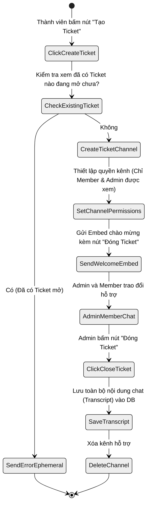
```mermaid


%%{init: {'theme': 'neutral'}}%%


stateDiagram-v2


    [*] --> ClickCreateTicket : Thành viên bấm nút "Tạo Ticket"


    ClickCreateTicket --> CheckExistingTicket : Kiểm tra xem đã có Ticket nào đang mở chưa?


    CheckExistingTicket --> SendErrorEphemeral : Có (Đã có Ticket mở)


    SendErrorEphemeral --> [*]


    


    CheckExistingTicket --> CreateTicketChannel : Không


    CreateTicketChannel --> SetChannelPermissions : Thiết lập quyền kênh (Chỉ Member & Admin được xem)


    SetChannelPermissions --> SendWelcomeEmbed : Gửi Embed chào mừng kèm nút "Đóng Ticket"


    SendWelcomeEmbed --> AdminMemberChat : Admin và Member trao đổi hỗ trợ


    AdminMemberChat --> ClickCloseTicket : Admin bấm nút "Đóng Ticket"


    ClickCloseTicket --> SaveTranscript : Lưu toàn bộ nội dung chat (Transcript) vào DB


    SaveTranscript --> DeleteChannel : Xóa kênh hỗ trợ


    DeleteChannel --> [*]


```


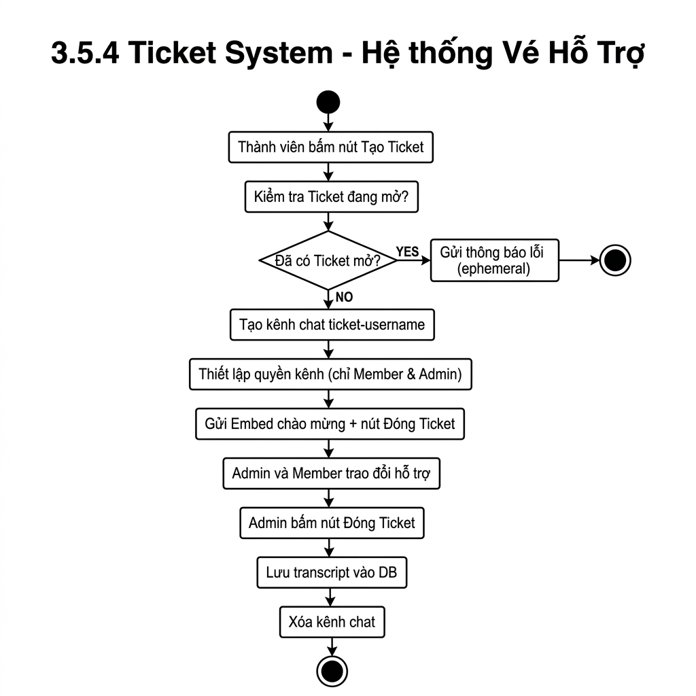


#### 3.5.5. Luồng Kênh thoại tạm thời (Voice Generator)


Biểu đồ mô tả quy trình tự động tạo phòng thoại động khi có người dùng tham gia phòng chờ:


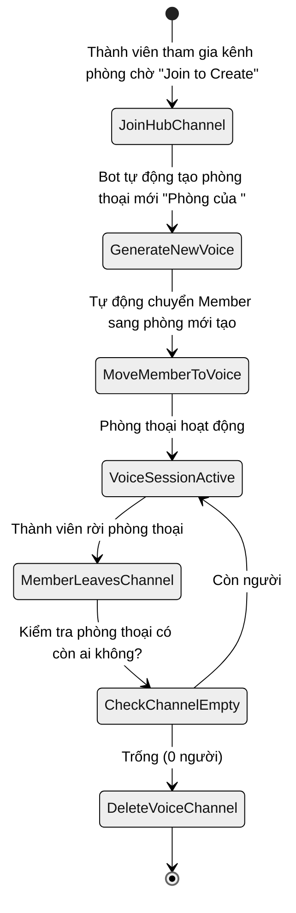
```mermaid


%%{init: {'theme': 'neutral'}}%%


stateDiagram-v2


    [*] --> JoinHubChannel : Thành viên tham gia kênh phòng chờ "Join to Create"


    JoinHubChannel --> GenerateNewVoice : Bot tự động tạo phòng thoại mới "Phòng của <tên-user>"


    GenerateNewVoice --> MoveMemberToVoice : Tự động chuyển Member sang phòng mới tạo


    MoveMemberToVoice --> VoiceSessionActive : Phòng thoại hoạt động


    VoiceSessionActive --> MemberLeavesChannel : Thành viên rời phòng thoại


    MemberLeavesChannel --> CheckChannelEmpty : Kiểm tra phòng thoại có còn ai không?


    CheckChannelEmpty --> VoiceSessionActive : Còn người


    CheckChannelEmpty --> DeleteVoiceChannel : Trống (0 người)


    DeleteVoiceChannel --> [*]


```


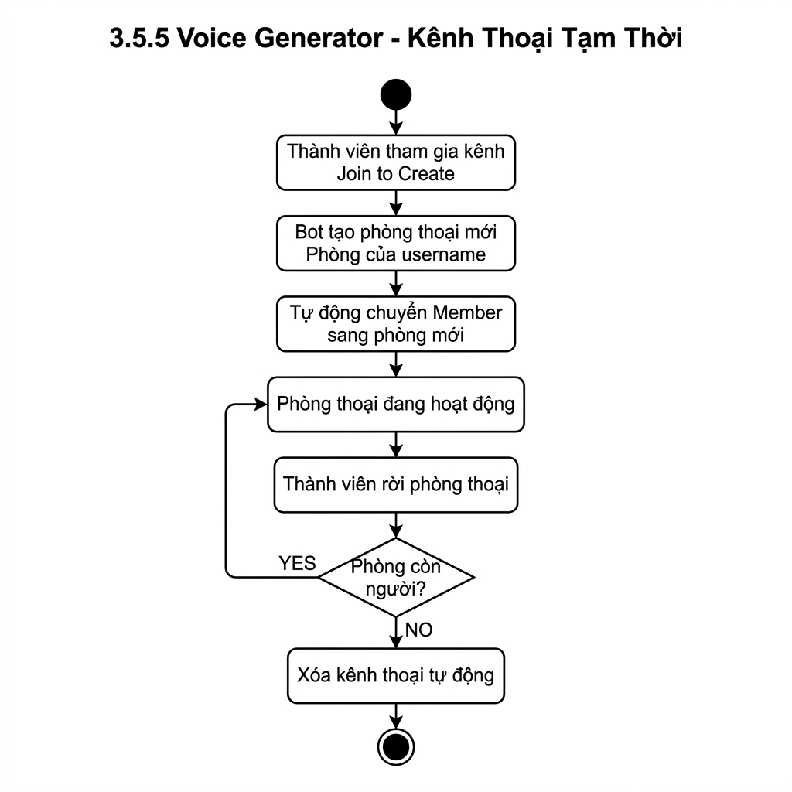


#### 3.5.6. Luồng Kinh nghiệm & Thăng cấp (Leveling & Economy)


Biểu đồ mô tả quy trình tính điểm kinh nghiệm tin nhắn, kiểm tra tăng cấp và tạo thẻ Rank Card:


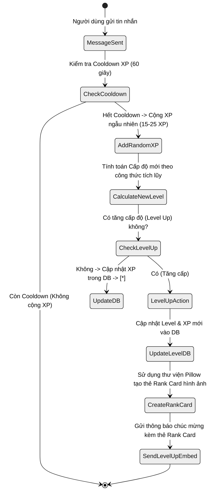
```mermaid


%%{init: {'theme': 'neutral'}}%%


stateDiagram-v2


    [*] --> MessageSent : Người dùng gửi tin nhắn


    MessageSent --> CheckCooldown : Kiểm tra Cooldown XP (60 giây)


    CheckCooldown --> [*] : Còn Cooldown (Không cộng XP)


    CheckCooldown --> AddRandomXP : Hết Cooldown -> Cộng XP ngẫu nhiên (15-25 XP)


    AddRandomXP --> CalculateNewLevel : Tính toán Cấp độ mới theo công thức tích lũy


    CalculateNewLevel --> CheckLevelUp : Có tăng cấp độ (Level Up) không?


    CheckLevelUp --> UpdateDB : Không -> Cập nhật XP trong DB -> [*]


    CheckLevelUp --> LevelUpAction : Có (Tăng cấp)


    LevelUpAction --> UpdateLevelDB : Cập nhật Level & XP mới vào DB


    UpdateLevelDB --> CreateRankCard : Sử dụng thư viện Pillow tạo thẻ Rank Card hình ảnh


    CreateRankCard --> SendLevelUpEmbed : Gửi thông báo chúc mừng kèm thẻ Rank Card


    SendLevelUpEmbed --> [*]


```


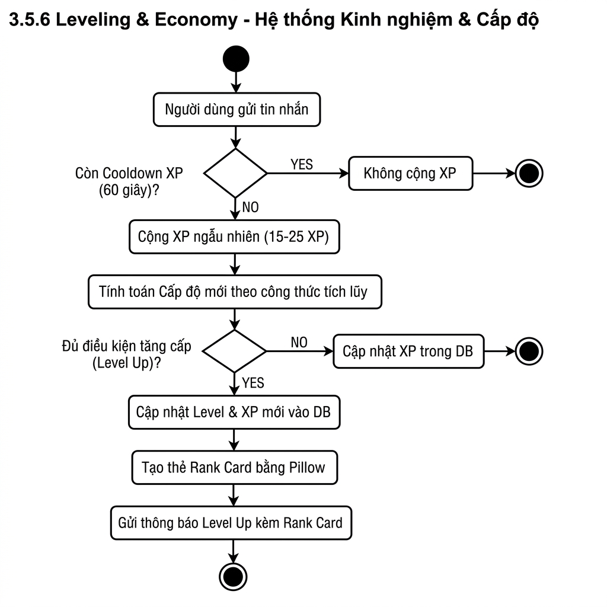


#### 3.5.7. Luồng Theo dõi mạng xã hội (Social Media Tracker)


Biểu đồ mô tả quy trình chạy ngầm quét và gửi thông báo tin tức mới:


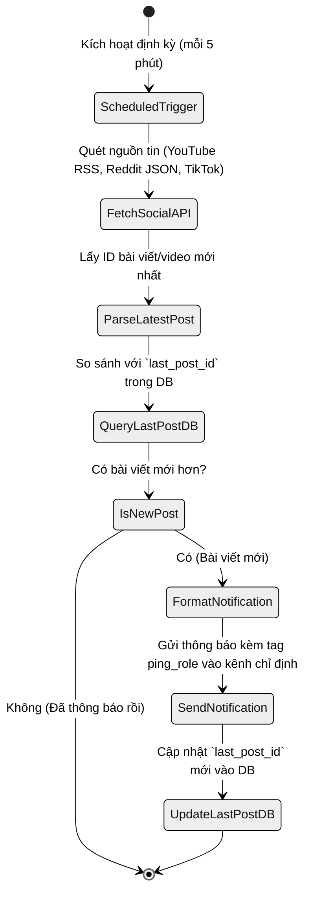
```mermaid


%%{init: {'theme': 'neutral'}}%%


stateDiagram-v2


    [*] --> ScheduledTrigger : Kích hoạt định kỳ (mỗi 5 phút)


    ScheduledTrigger --> FetchSocialAPI : Quét nguồn tin (YouTube RSS, Reddit JSON, TikTok)


    FetchSocialAPI --> ParseLatestPost : Lấy ID bài viết/video mới nhất


    ParseLatestPost --> QueryLastPostDB : So sánh với `last_post_id` trong DB


    QueryLastPostDB --> IsNewPost : Có bài viết mới hơn?


    IsNewPost --> [*] : Không (Đã thông báo rồi)


    IsNewPost --> FormatNotification : Có (Bài viết mới)


    FormatNotification --> SendNotification : Gửi thông báo kèm tag ping_role vào kênh chỉ định


    SendNotification --> UpdateLastPostDB : Cập nhật `last_post_id` mới vào DB


    UpdateLastPostDB --> [*]


```


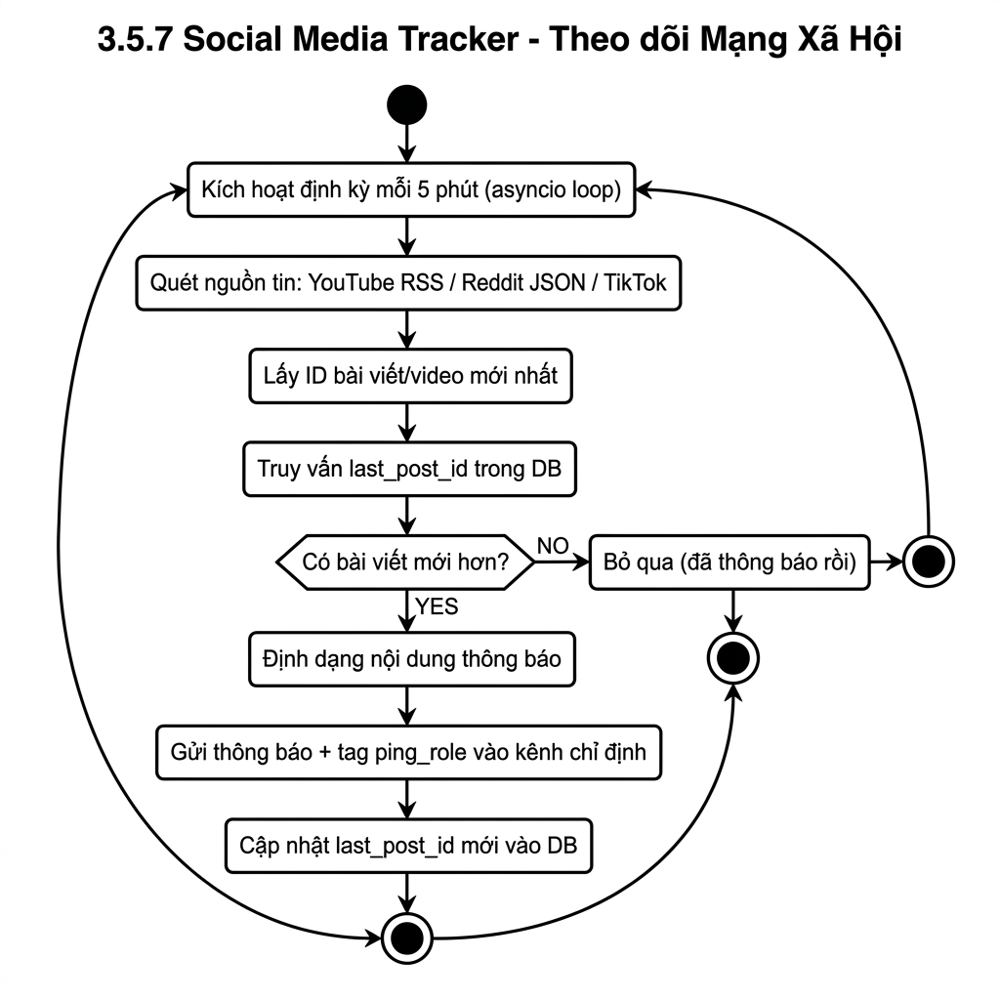


#### 3.5.8. Luồng Cấu hình qua Web Dashboard


Biểu đồ mô tả quy trình tải cấu hình và cập nhật nóng từ giao diện web sang bot core:


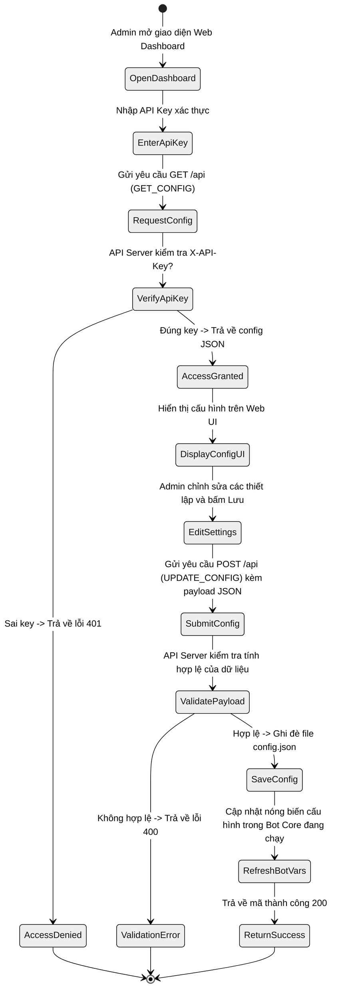
```mermaid


%%{init: {'theme': 'neutral'}}%%


stateDiagram-v2


    [*] --> OpenDashboard : Admin mở giao diện Web Dashboard


    OpenDashboard --> EnterApiKey : Nhập API Key xác thực


    EnterApiKey --> RequestConfig : Gửi yêu cầu GET /api (GET_CONFIG)


    RequestConfig --> VerifyApiKey : API Server kiểm tra X-API-Key?


    VerifyApiKey --> AccessDenied : Sai key -> Trả về lỗi 401


    AccessDenied --> [*]


    VerifyApiKey --> AccessGranted : Đúng key -> Trả về config JSON


    AccessGranted --> DisplayConfigUI : Hiển thị cấu hình trên Web UI


    DisplayConfigUI --> EditSettings : Admin chỉnh sửa các thiết lập và bấm Lưu


    EditSettings --> SubmitConfig : Gửi yêu cầu POST /api (UPDATE_CONFIG) kèm payload JSON


    SubmitConfig --> ValidatePayload : API Server kiểm tra tính hợp lệ của dữ liệu


    ValidatePayload --> ValidationError : Không hợp lệ -> Trả về lỗi 400


    ValidationError --> [*]


    ValidatePayload --> SaveConfig : Hợp lệ -> Ghi đè file config.json


    SaveConfig --> RefreshBotVars : Cập nhật nóng biến cấu hình trong Bot Core đang chạy


    RefreshBotVars --> ReturnSuccess : Trả về mã thành công 200


    ReturnSuccess --> [*]


```


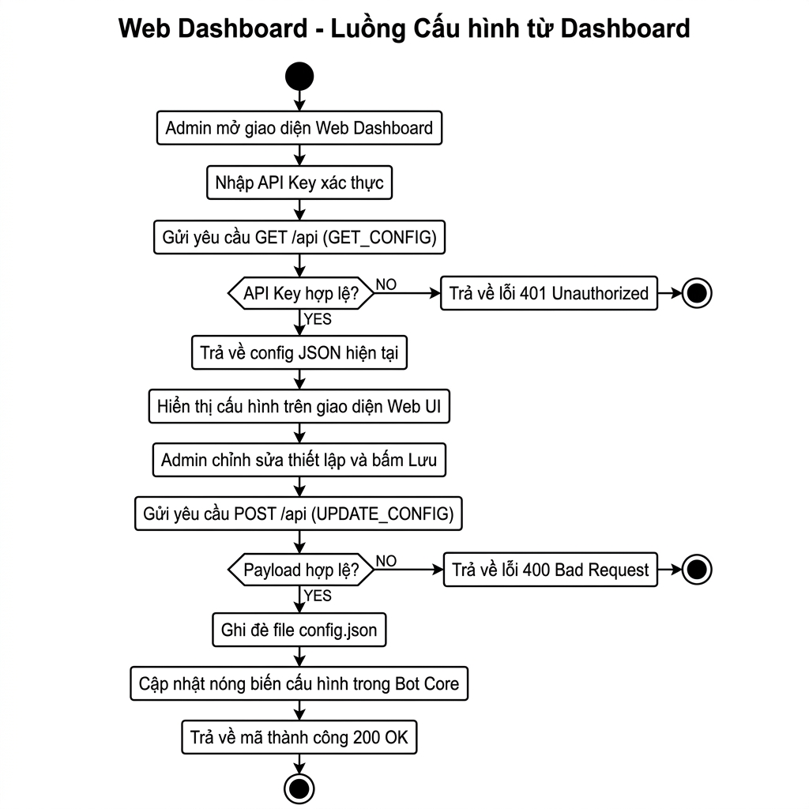


---


## 4. Thiết kế hệ thống


### 4.1. Kiến trúc hệ thống


Hệ thống được thiết kế theo kiến trúc phân tầng **Component-based & Event-driven** nhằm đảm bảo tính độc lập, khả năng bảo trì cao và hiệu năng xử lý không đồng bộ.


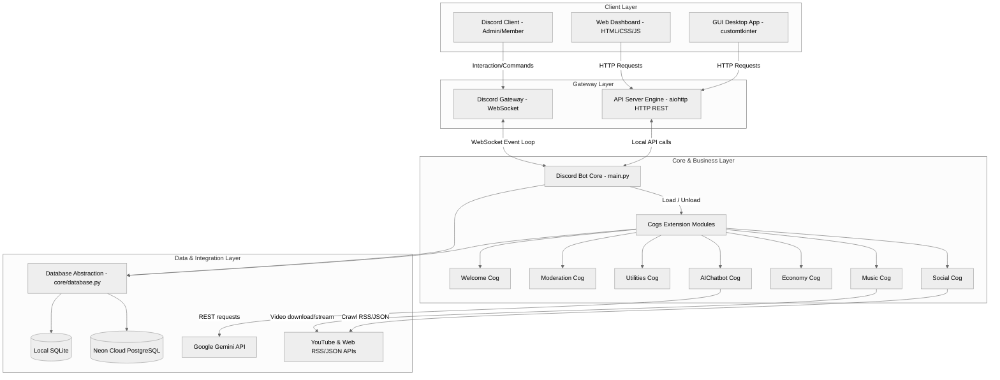
```mermaid


%%{init: {'theme': 'neutral'}}%%


graph TB


    subgraph Client Layer


        Web[Web Dashboard - HTML/CSS/JS]


        Desktop[GUI Desktop App - customtkinter]


        User[Discord Client - Admin/Member]


    end


    subgraph Gateway Layer


        Gateway[Discord Gateway - WebSocket]


        API[API Server Engine - aiohttp HTTP REST]


    end


    subgraph Core & Business Layer


        Bot[Discord Bot Core - main.py]


        Cogs[Cogs Extension Modules]


        Welcome[Welcome Cog]


        Mod[Moderation Cog]


        Util[Utilities Cog]


        Music[Music Cog]


        Eco[Economy Cog]


        Social[Social Cog]


        Chat[AIChatbot Cog]


    end


    subgraph Data & Integration Layer


        DB[Database Abstraction - core/database.py]


        SQLite[(Local SQLite)]


        Postgres[(Neon Cloud PostgreSQL)]


        Gemini[Google Gemini API]


        YT[YouTube & Web RSS/JSON APIs]


    end


    Web -->|HTTP Requests| API


    Desktop -->|HTTP Requests| API


    User -->|Interaction/Commands| Gateway


    Gateway <-->|WebSocket Event Loop| Bot


    API <-->|Local API calls| Bot


    Bot -->|Load / Unload| Cogs


    Cogs --> Welcome


    Cogs --> Mod


    Cogs --> Util


    Cogs --> Music


    Cogs --> Eco


    Cogs --> Social


    Cogs --> Chat


    


    Chat -->|REST requests| Gemini


    Music -->|Video download/stream| YT


    Social -->|Crawl RSS/JSON| YT


    


    Bot --> DB


    Cogs --> DB


    DB --> SQLite


    DB --> Postgres


```


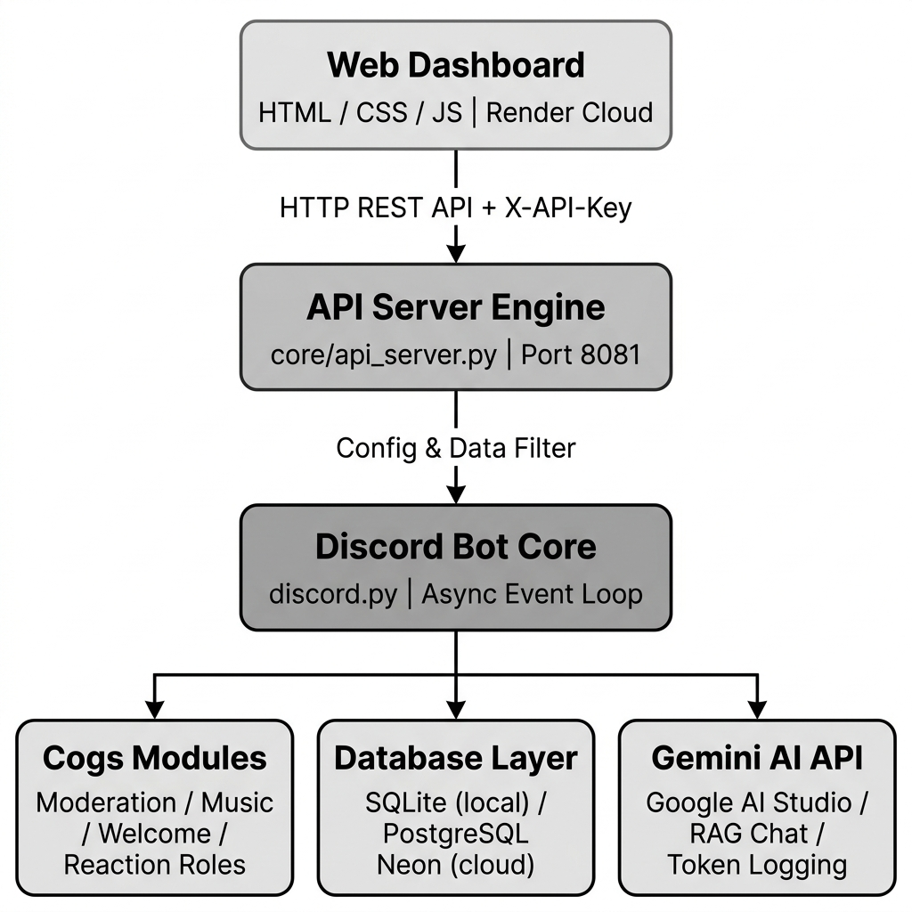


#### Các tầng trong kiến trúc:


1. **Tầng Giao diện (Client Layer):** Điểm tiếp xúc của người dùng. Admin sử dụng Web Dashboard hoặc Desktop GUI để điều chỉnh; Member sử dụng ứng dụng Discord Client thông thường.


2. **Tầng Kết nối Gateway (Gateway Layer):** Kênh truyền thông. Discord WebSocket Gateway giúp duy trì kết nối luồng sự kiện liên tục. API Server Engine chạy ngầm nhận yêu cầu HTTP từ dashboard ngoài.


3. **Tầng Lõi nghiệp vụ (Core & Business Layer):** Trung tâm điều phối. `main.py` khởi tạo bot, nạp các Cogs độc lập qua cơ chế Extension. Mỗi Cog đóng gói logic nghiệp vụ riêng biệt giúp phân tách mã nguồn rõ ràng.


4. **Tầng Dữ liệu và Liên kết ngoài (Data & Integration Layer):** Giao tiếp dữ liệu. Class `database.py` ẩn đi chi tiết cài đặt của SQLite/PostgreSQL. Các API của Google Gemini và yt-dlp phục vụ tính năng đàm thoại thông minh và âm nhạc.


---


### 4.2. Thiết kế Class & Sequence Diagrams


#### 4.2.1. Class Diagram (Sơ đồ lớp)


Sơ đồ lớp biểu diễn cấu trúc của hệ thống, các lớp Cog chính kế thừa từ thư viện `discord.ext.commands.Cog` và các lớp giao diện Views hỗ trợ tương tác trên Discord.



```mermaid
%%{init: {'theme': 'neutral'}}%%
classDiagram
    namespace LibraryBase {
        class commands_Cog {
            <<discord.py>>
        }
        class discord_ui_View {
            <<discord.py>>
        }
        class discord_ui_Modal {
            <<discord.py>>
        }
        class discord_ui_Button {
            <<discord.py>>
        }
    }

    namespace CoreBot {
        class DiscordBot {
            <<main.py>>
            +config : dict
            +setup_hook() None
            +on_ready() None
            +check_timed_roles() None
            +check_gui_tasks() None
        }
    }

    namespace BusinessCogs {
        class AIChatbot {
            <<cogs/ai_chatbot.py>>
            +api_key : str
            +model : GenerativeModel
            +chat_sessions : dict
            +rate_limit_window : float
            +max_messages_in_window : int
            -_get_session(guild_id, user_id) ChatSession
            -_load_history_from_db(guild_id, user_id) list
            -_retrieve_relevant_rules(query) str
            -_save_token_usage_to_db(...) None
            +on_message(message) None
            +ask(interaction, question) None
            +clear_history(interaction) None
            +check_spam_protection(message) bool
        }
        class Moderation {
            <<cogs/moderation.py>>
            +blacklist_words : list
            +nuke_tracker : dict
            +on_message(message) None
            +on_guild_channel_delete(channel) None
            +kick(ctx, member, reason) None
            +ban(ctx, member, reason) None
            +mute(ctx, member, time) None
            +warn(ctx, member, reason) None
        }
        class Music {
            <<cogs/music.py>>
            +play_next(ctx) None
            +play(ctx, search) None
            +skip(ctx) None
            +pause(ctx) None
            +resume(ctx) None
            +stop(ctx) None
        }
        class Utilities {
            <<cogs/utilities.py>>
            +spawn_ticket_panel(ctx) None
            +spawn_reaction_role(ctx) None
        }
        class Economy {
            <<cogs/economy.py>>
            +on_message(message) None
            +leaderboard(ctx) None
            +rank(ctx, member) None
        }
        class Social {
            <<cogs/social.py>>
            +social_media_loop() None
            +add_social(ctx, ...) None
            +rm_social(ctx, ...) None
        }
        class Welcome {
            <<cogs/welcome.py>>
            +on_member_join(member) None
            +on_member_remove(member) None
        }
    }

    namespace UIViews {
        class MusicControlView {
            +pause_resume(interaction) None
            +skip(interaction) None
            +stop(interaction) None
            +shuffle(interaction) None
            +autoplay_toggle(interaction) None
        }
        class TicketView {
            +create_ticket(interaction) None
        }
        class TicketControlView {
            +close_ticket(interaction) None
        }
        class VoiceGeneratorView {
            +create_voice() None
        }
        class VoiceNameModal {
            +on_submit(interaction) None
        }
        class PersistentRoleView {
            +__init__()
        }
        class RoleButton {
            +callback(interaction) None
        }
    }

    namespace Infrastructure {
        class DatabaseProxy {
            <<core/database.py>>
            +conn : Connection
            +db_get_user(guild_id, user_id) tuple
            +db_update_xp(guild_id, user_id, xp) tuple
        }
        class ApiServerProxy {
            <<core/api_server.py>>
            +create_handle_api(bot) Coroutine
            +handle_health(request) Response
        }
    }

    %% Ke thua tu library
    commands_Cog <|-- AIChatbot
    commands_Cog <|-- Music
    commands_Cog <|-- Moderation
    commands_Cog <|-- Utilities
    commands_Cog <|-- Social
    commands_Cog <|-- Economy
    commands_Cog <|-- Welcome

    discord_ui_View <|-- MusicControlView
    discord_ui_View <|-- TicketView
    discord_ui_View <|-- TicketControlView
    discord_ui_View <|-- VoiceGeneratorView
    discord_ui_View <|-- PersistentRoleView
    discord_ui_Modal <|-- VoiceNameModal
    discord_ui_Button <|-- RoleButton

    %% Bot Core nap Cogs
    DiscordBot --> AIChatbot : loads
    DiscordBot --> Music : loads
    DiscordBot --> Moderation : loads
    DiscordBot --> Utilities : loads
    DiscordBot --> Social : loads
    DiscordBot --> Economy : loads
    DiscordBot --> Welcome : loads

    %% Cogs su dung Views
    Music ..> MusicControlView : uses
    Utilities ..> TicketView : uses
    Utilities ..> TicketControlView : uses
    Utilities ..> VoiceGeneratorView : uses
    Utilities ..> VoiceNameModal : uses
    Utilities ..> PersistentRoleView : uses
    Utilities ..> RoleButton : uses

    %% Tat ca Cogs truy van DB
    AIChatbot --> DatabaseProxy : queries
    Music --> DatabaseProxy : queries
    Moderation --> DatabaseProxy : queries
    Utilities --> DatabaseProxy : queries
    Social --> DatabaseProxy : queries
    Economy --> DatabaseProxy : queries
    Welcome --> DatabaseProxy : queries

    DiscordBot --> ApiServerProxy : interacts

```
```


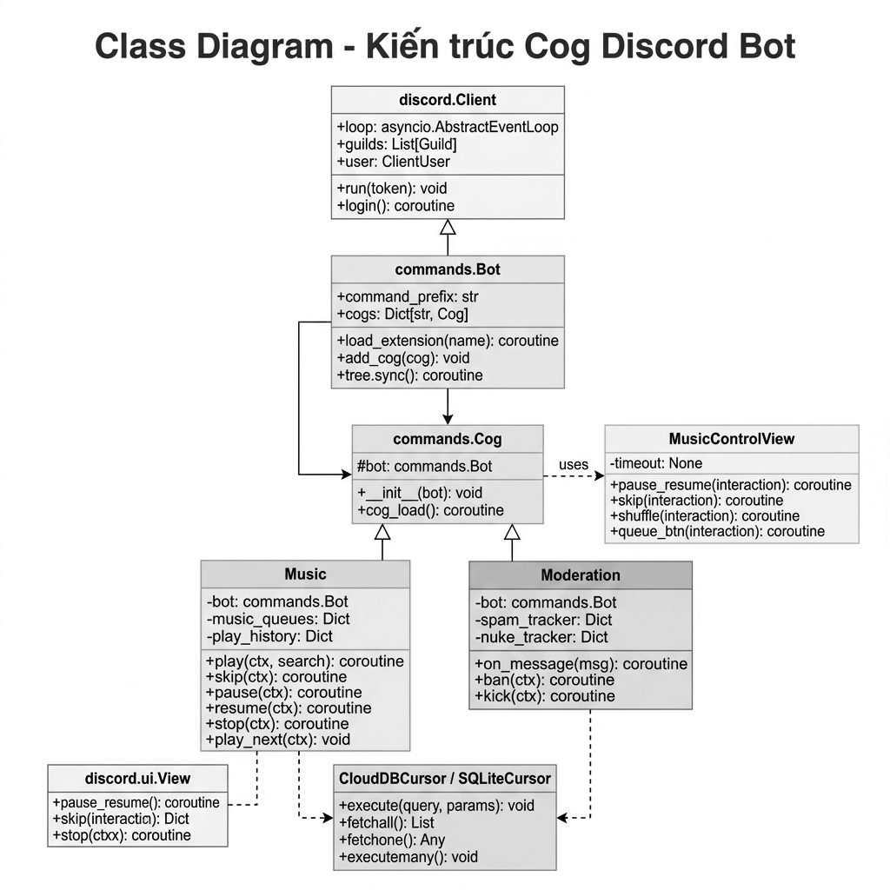


- **Mô tả cấu trúc lớp tổng thể:**


  - `DiscordBot`: Hạt nhân điều khiển của hệ thống, xử lý vòng lặp sự kiện của Discord và chạy ngầm các scheduler tác vụ.


  - **Nhóm Cogs Nghiệp Vụ:**


    - `AIChatbot`: Quản lý đàm thoại AI, xử lý RAG và cơ chế chống spam bằng Sliding Window.


    - `Music`: Điều khiển việc stream nhạc YouTube/SoundCloud thông qua FFmpeg.


    - `Moderation`: Đảm nhận việc kiểm duyệt từ cấm (Blacklist), chống phá hoại (Anti-Nuke) và xử lý hình phạt.


    - `Utilities`: Tích hợp các công cụ tự phục vụ: hệ thống ticket, tạo phòng voice và reaction roles.


    - `Social`: Crawl và theo dõi cập nhật từ các nguồn tin tức xã hội (YouTube, Reddit, TikTok).


    - `Economy`: Quản lý điểm kinh nghiệm (XP), cấp độ (Level) và xếp hạng thành viên.


    - `Welcome`: Xử lý gửi lời chào mừng thành viên mới và thông báo khi thành viên rời máy chủ.


  - **Nhóm Giao Diện & Tương Tác (Views / Modals / Buttons):**


    - `MusicControlView`: Bộ nút bấm điều khiển nhạc dưới Embed phát nhạc.


    - `DoiLinkView`: Quản lý giao diện cấu hình RSS/Feed xã hội.


    - `TicketView` & `TicketControlView`: Tạo và đóng luồng kênh ticket hỗ trợ.


    - `VoiceGeneratorView` & `VoiceNameModal`: Đăng ký và tạo phòng thoại động tạm thời.


    - `PersistentRoleView` & `RoleButton`: Panel tự chọn vai trò lưu trữ trạng thái lâu dài.


    - `QuizView` & `QuizAnswerButton`: Panel trắc nghiệm xác minh danh tính người dùng mới.


  - **Nhóm Thành Phần Hỗ Trợ (Proxies):**


    - `DatabaseProxy`: Trừu tượng hóa SQLite/PostgreSQL để thao tác lưu trữ đồng bộ.


    - `ApiServerProxy`: Đại diện cho API Server Engine (`core/api_server.py`) xử lý IPC truyền cấu hình từ Dashboard về Bot Core.


---


#### 4.2.2. Sequence Diagrams (Biểu đồ tuần tự)


##### 4.2.2.1. Luồng chạy lệnh `/play` phát nhạc


Biểu đồ dưới đây thể hiện sự tương tác giữa Người dùng, Bot Core, Music Cog, yt-dlp, và FFmpeg để phát nhạc:


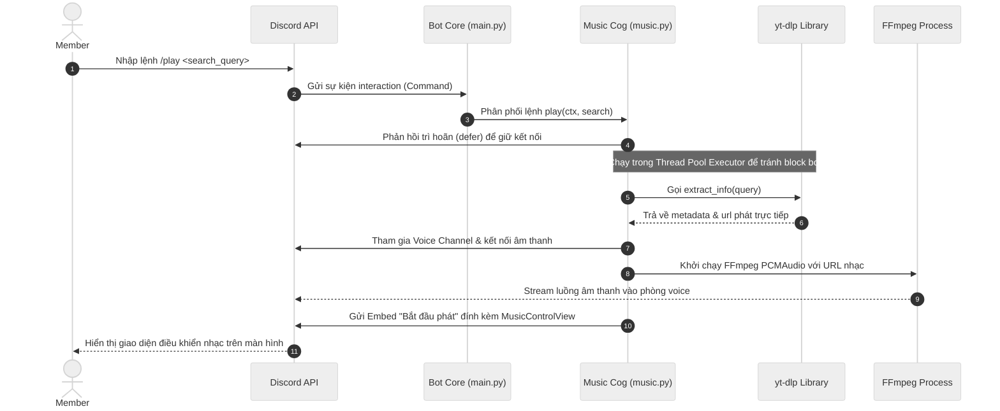
```mermaid


%%{init: {'theme': 'neutral'}}%%


sequenceDiagram


    autonumber


    actor User as Member


    participant Discord as Discord API


    participant Bot as Bot Core (main.py)


    participant Cog as Music Cog (music.py)


    participant YTDL as yt-dlp Library


    participant FFmpeg as FFmpeg Process


    User->>Discord: Nhập lệnh /play <search_query>


    Discord->>Bot: Gửi sự kiện interaction (Command)


    Bot->>Cog: Phân phối lệnh play(ctx, search)


    Cog->>Discord: Phản hồi trì hoãn (defer) để giữ kết nối


    Note over Cog, YTDL: Chạy trong Thread Pool Executor để tránh block bot


    Cog->>YTDL: Gọi extract_info(query)


    YTDL-->>Cog: Trả về metadata & url phát trực tiếp


    Cog->>Discord: Tham gia Voice Channel & kết nối âm thanh


    Cog->>FFmpeg: Khởi chạy FFmpeg PCMAudio với URL nhạc


    FFmpeg-->>Discord: Stream luồng âm thanh vào phòng voice


    Cog->>Discord: Gửi Embed "Bắt đầu phát" đính kèm MusicControlView


    Discord-->>User: Hiển thị giao diện điều khiển nhạc trên màn hình


```


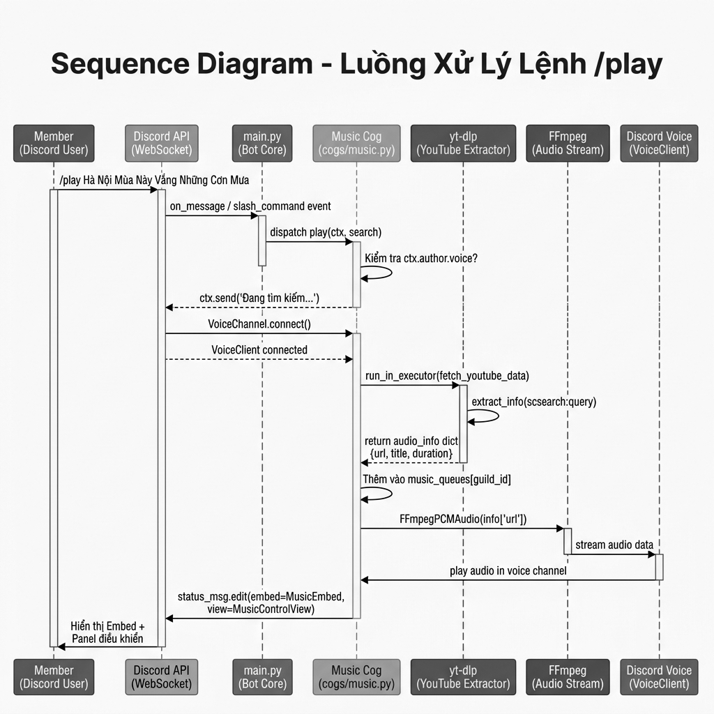


##### 4.2.2.2. Luồng đàm thoại AI và lưu lịch sử (`/chat` hoặc tin nhắn kênh AI)


Biểu đồ tuần tự chi tiết quy trình xử lý, tra cứu RAG luật lệ và ghi nhận token tiêu hao:


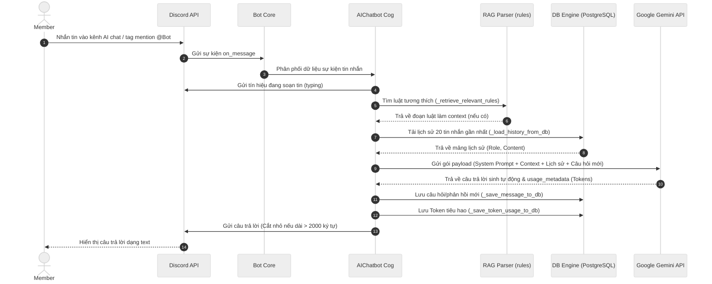
```mermaid


%%{init: {'theme': 'neutral'}}%%


sequenceDiagram


    autonumber


    actor User as Member


    participant Discord as Discord API


    participant Bot as Bot Core


    participant Cog as AIChatbot Cog


    participant RAG as RAG Parser (rules)


    participant DB as DB Engine (PostgreSQL)


    participant Gemini as Google Gemini API


    User->>Discord: Nhắn tin vào kênh AI chat / tag mention @Bot


    Discord->>Bot: Gửi sự kiện on_message


    Bot->>Cog: Phân phối dữ liệu sự kiện tin nhắn


    Cog->>Discord: Gửi tín hiệu đang soạn tin (typing)


    Cog->>RAG: Tìm luật tương thích (_retrieve_relevant_rules)


    RAG-->>Cog: Trả về đoạn luật làm context (nếu có)


    Cog->>DB: Tải lịch sử 20 tin nhắn gần nhất (_load_history_from_db)


    DB-->>Cog: Trả về mảng lịch sử (Role, Content)


    Cog->>Gemini: Gửi gói payload (System Prompt + Context + Lịch sử + Câu hỏi mới)


    Gemini-->>Cog: Trả về câu trả lời sinh tự động & usage_metadata (Tokens)


    Cog->>DB: Lưu câu hỏi/phản hồi mới (_save_message_to_db)


    Cog->>DB: Lưu Token tiêu hao (_save_token_usage_to_db)


    Cog->>Discord: Gửi câu trả lời (Cắt nhỏ nếu dài > 2000 ký tự)


    Discord-->>User: Hiển thị câu trả lời dạng text


```


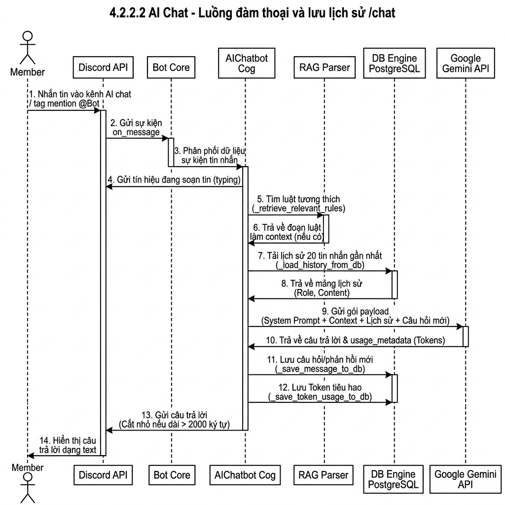

##### 4.2.2.3. Luồng kiểm duyệt tự động AutoMod

Biểu đồ tuần tự mô tả chi tiết luồng xử lý sự kiện `on_message` qua các bộ lọc và hành động phạt của Moderation Cog:

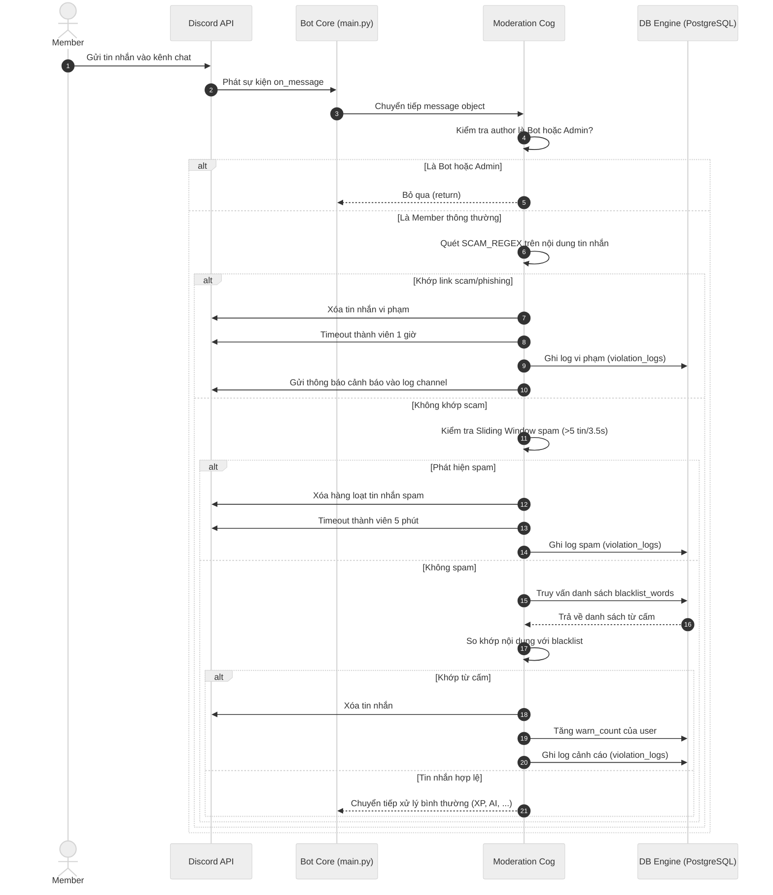
```mermaid
%%{init: {'theme': 'neutral'}}%%
sequenceDiagram
    autonumber
    actor User as Member
    participant Discord as Discord API
    participant Bot as Bot Core (main.py)
    participant Cog as Moderation Cog
    participant DB as DB Engine (PostgreSQL)

    User->>Discord: Gửi tin nhắn vào kênh chat
    Discord->>Bot: Phát sự kiện on_message
    Bot->>Cog: Chuyển tiếp message object

    Cog->>Cog: Kiểm tra author là Bot hoặc Admin?
    alt Là Bot hoặc Admin
        Cog-->>Bot: Bỏ qua (return)
    else Là Member thông thường
        Cog->>Cog: Quét SCAM_REGEX trên nội dung tin nhắn
        alt Khớp link scam/phishing
            Cog->>Discord: Xóa tin nhắn vi phạm
            Cog->>Discord: Timeout thành viên 1 giờ
            Cog->>DB: Ghi log vi phạm (violation_logs)
            Cog->>Discord: Gửi thông báo cảnh báo vào log channel
        else Không khớp scam
            Cog->>Cog: Kiểm tra Sliding Window spam (>5 tin/3.5s)
            alt Phát hiện spam
                Cog->>Discord: Xóa hàng loạt tin nhắn spam
                Cog->>Discord: Timeout thành viên 5 phút
                Cog->>DB: Ghi log spam (violation_logs)
            else Không spam
                Cog->>DB: Truy vấn danh sách blacklist_words
                DB-->>Cog: Trả về danh sách từ cấm
                Cog->>Cog: So khớp nội dung với blacklist
                alt Khớp từ cấm
                    Cog->>Discord: Xóa tin nhắn
                    Cog->>DB: Tăng warn_count của user
                    Cog->>DB: Ghi log cảnh cáo (violation_logs)
                else Tin nhắn hợp lệ
                    Cog-->>Bot: Chuyển tiếp xử lý bình thường (XP, AI, ...)
                end
            end
        end
    end
```

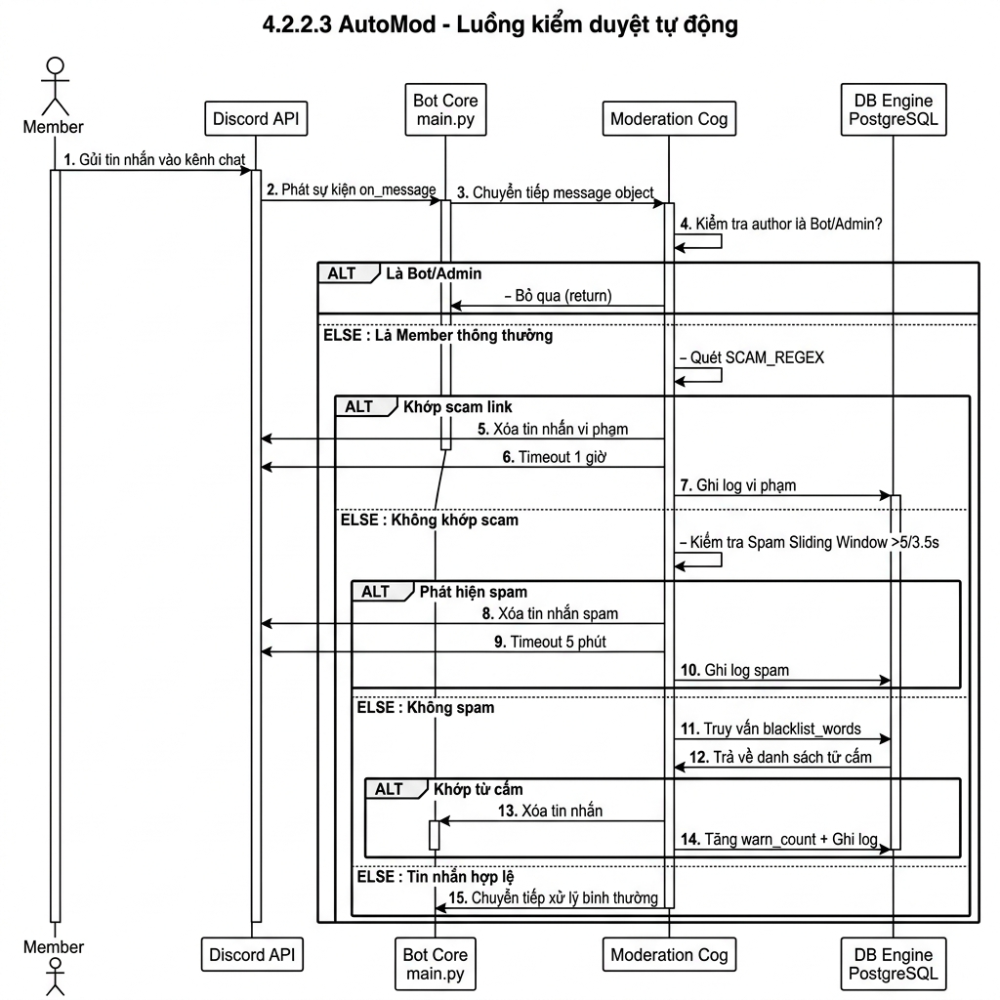

##### 4.2.2.4. Luồng đàm thoại AI đầy đủ (AI Chat Full Flow)

Biểu đồ tuần tự mô tả chi tiết từ bước nhận tin nhắn, qua RAG, gọi Gemini API đến ghi nhận token và trả lời:

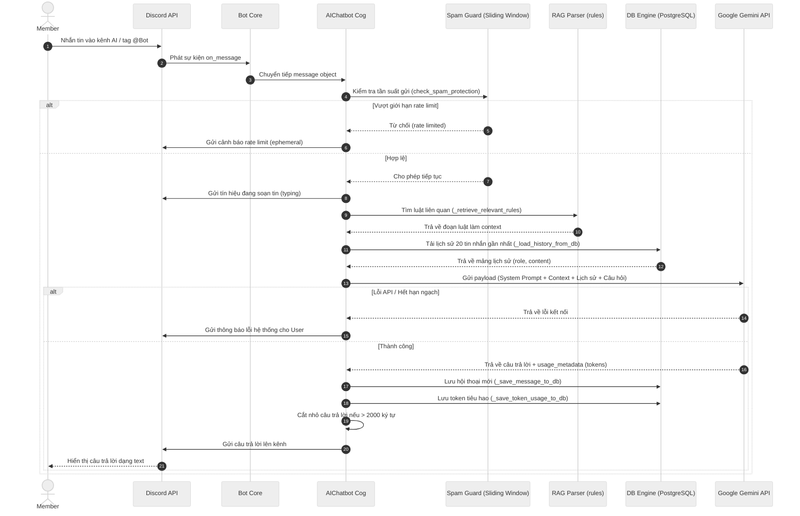
```mermaid
%%{init: {'theme': 'neutral'}}%%
sequenceDiagram
    autonumber
    actor User as Member
    participant Discord as Discord API
    participant Bot as Bot Core
    participant Cog as AIChatbot Cog
    participant Guard as Spam Guard (Sliding Window)
    participant RAG as RAG Parser (rules)
    participant DB as DB Engine (PostgreSQL)
    participant Gemini as Google Gemini API

    User->>Discord: Nhắn tin vào kênh AI / tag @Bot
    Discord->>Bot: Phát sự kiện on_message
    Bot->>Cog: Chuyển tiếp message object

    Cog->>Guard: Kiểm tra tần suất gửi (check_spam_protection)
    alt Vượt giới hạn rate limit
        Guard-->>Cog: Từ chối (rate limited)
        Cog->>Discord: Gửi cảnh báo rate limit (ephemeral)
    else Hợp lệ
        Guard-->>Cog: Cho phép tiếp tục
        Cog->>Discord: Gửi tín hiệu đang soạn tin (typing)
        Cog->>RAG: Tìm luật liên quan (_retrieve_relevant_rules)
        RAG-->>Cog: Trả về đoạn luật làm context
        Cog->>DB: Tải lịch sử 20 tin nhắn gần nhất (_load_history_from_db)
        DB-->>Cog: Trả về mảng lịch sử (role, content)
        Cog->>Gemini: Gửi payload (System Prompt + Context + Lịch sử + Câu hỏi)
        alt Lỗi API / Hết hạn ngạch
            Gemini-->>Cog: Trả về lỗi kết nối
            Cog->>Discord: Gửi thông báo lỗi hệ thống cho User
        else Thành công
            Gemini-->>Cog: Trả về câu trả lời + usage_metadata (tokens)
            Cog->>DB: Lưu hội thoại mới (_save_message_to_db)
            Cog->>DB: Lưu token tiêu hao (_save_token_usage_to_db)
            Cog->>Cog: Cắt nhỏ câu trả lời nếu > 2000 ký tự
            Cog->>Discord: Gửi câu trả lời lên kênh
            Discord-->>User: Hiển thị câu trả lời dạng text
        end
    end
```

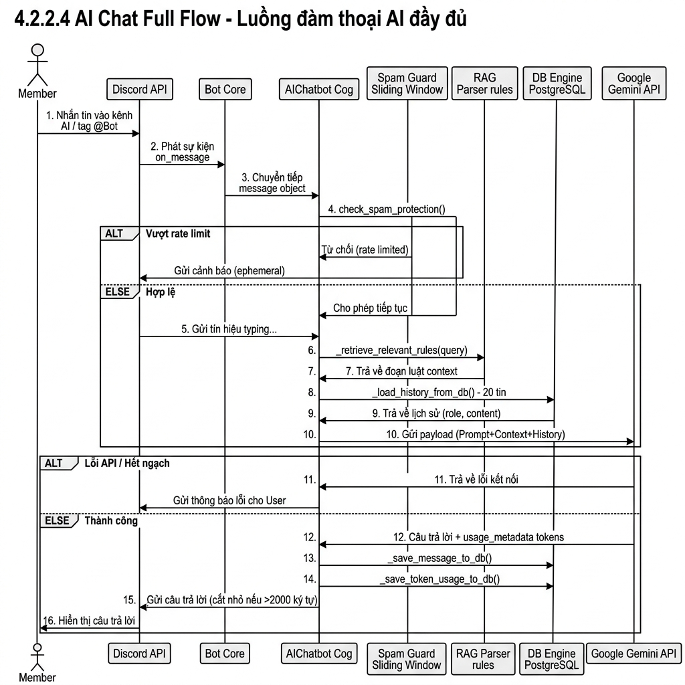


---


### 4.3. Thiết kế giao diện (UI Layout)


#### 4.3.1. Thiết kế Giao diện trên Discord (Discord Interactive Embeds)


Giao diện người dùng đầu cuối của bot trên Discord sử dụng cấu trúc nhúng (Embed) và các nút tương tác (Buttons).


- **Panel Phát nhạc (Music Control Panel):**


  - **Header:** Tiêu đề nhúng chứa trạng thái phát nhạc (Bắt đầu phát / Đề xuất nhạc).


  - **Body:** Tên bài hát (hyperlink dẫn tới YouTube), ảnh đại diện Thumbnail của video, thời lượng bài hát, và tên kênh đăng tải.


  - **Footer:** Chứa danh sách các nút bấm:


    - `⏸️ Tạm Dừng / Phát` (Primary - Blue): Tạm dừng nhạc hoặc tiếp tục phát.


    - `⏭️ Bỏ Qua` (Secondary - Grey): Bỏ qua bài hiện tại và phát bài kế tiếp.


    - `⏹️ Tắt Nhạc` (Danger - Red): Xóa hàng đợi và ngắt kết nối voice.


    - `🔀 Trộn Bài` (Success - Green): Xáo trộn các bài hát trong hàng đợi.


    - `📜 Hàng Đợi` (Secondary - Grey): Hiển thị danh sách 10 bài hát tiếp theo ở dạng tin nhắn ẩn (ephemeral).


    - `🎲 Tự Động Phát` (Secondary - Grey): Bật hoặc tắt tính năng đề xuất AutoPlay.


- **Panel Tự chọn vai trò (Reaction Role Panel):**


  - Giao diện Embed hiển thị thông tin giới thiệu server. Dưới tin nhắn hiển thị các nút tương tác gắn nhãn tương ứng với tên vai trò (ví dụ: `🔔 Thông báo`, `🎮 Game thủ`). Người dùng nhấp để nhận vai trò và nhấp lại lần nữa để gỡ bỏ.


#### 4.3.2. Thiết kế Giao diện Web Dashboard (Admin Web SPA)


Giao diện Web Dashboard dành cho Admin được xây dựng theo phong cách hiện đại với thiết kế Dark mode sang trọng, sử dụng Vanilla HTML/CSS/JS kết hợp CSS Glassmorphism:


- **Trang Dashboard thống kê (Stats View):** Hiển thị các ô thẻ Glass card thể hiện:


  - Uptime của Bot (Đọc từ API `/health`).


  - Số lượng thành viên của Server, số server Bot đang tham gia, độ trễ Ping (ms).


  - Số lượng kênh thoại đang hoạt động đồng thời.


- **Trang Cấu hình hệ thống (Configuration View):**


  - Trường nhập Prefix (Tiền tố lệnh).


  - Bật/tắt các module tính năng (AutoMod, Music, Economy) dạng công tắc Switch.


  - Khung văn bản sửa đổi Prompt hệ thống dành cho AI Gemini.


- **Trang Quản lý danh sách từ cấm (Blacklist View):**


  - Bảng hiển thị danh sách từ bị cấm trong server.


  - Nút thêm từ cấm mới và nút xóa từ cấm trực tiếp gọi xuống API Server.


---


### 4.4. Thiết kế cơ sở dữ liệu & Mô hình ERD


Cơ sở dữ liệu của hệ thống lưu trữ toàn bộ thông tin hoạt động, lịch sử đàm thoại AI, điểm kinh nghiệm thăng cấp, cảnh cáo vi phạm và hàng đợi công việc IPC.


#### 4.4.1. Mô tả chi tiết các bảng dữ liệu


1. **users:** Lưu thông tin điểm kinh nghiệm tích lũy của thành viên ở từng Guild.


   - `guild_id` (TEXT), `user_id` (TEXT) tạo thành Khóa chính phức hợp.


   - `xp` (INTEGER): Tổng điểm kinh nghiệm tích lũy.


   - `level` (INTEGER): Cấp độ hiện tại.


2. **warnings:** Lưu thông tin cảnh cáo vi phạm kiểm duyệt.


   - `guild_id` (TEXT), `user_id` (TEXT) tạo thành Khóa chính phức hợp.


   - `warn_count` (INTEGER): Số lần bị cảnh cáo tích lũy.


3. **timed_roles:** Quản lý vai trò tạm thời có thời hạn (như cấm ngôn tạm thời).


   - `guild_id` (TEXT), `user_id` (TEXT), `role_id` (TEXT) tạo thành Khóa chính phức hợp.


   - `expires_at` (REAL): Epoch timestamp đánh dấu thời điểm vai trò tự động bị gỡ bỏ.


4. **blacklists:** Chứa bộ lọc từ cấm của từng server.


   - `guild_id` (TEXT), `word` (TEXT) tạo thành Khóa chính phức hợp.


5. **reaction_panels:** Lưu cấu hình reaction role để khôi phục trạng thái.


   - `message_id` (TEXT): Khóa chính, ID tin nhắn chứa panel trên Discord.


   - `guild_id` (TEXT): ID của server chứa panel.


   - `roles_json` (TEXT): Danh sách vai trò và nhãn nút bấm lưu ở dạng JSON text.


6. **social_tracker:** Thiết lập crawler tin tức mạng xã hội.


   - `guild_id` (TEXT), `platform` (TEXT), `target_id` (TEXT) làm Khóa chính phức hợp.


   - `channel_id` (TEXT): Kênh bot sẽ gửi thông báo.


   - `ping_role` (TEXT): Vai trò sẽ tag khi có tin mới.


   - `last_post_id` (TEXT): ID của bài viết mới nhất đã thông báo để tránh trùng lặp.


7. **quiz_questions:** Bộ câu hỏi trắc nghiệm xác minh thành viên mới.


   - `id` (INTEGER): Khóa chính tự tăng.


   - `guild_id` (TEXT): ID của máy chủ.


   - `question` (TEXT): Câu hỏi trắc nghiệm.


   - `option_a`, `option_b`, `option_c`, `option_d` (TEXT): Các phương án chọn.


   - `correct_option` (TEXT): Đáp án đúng.


8. **gui_tasks:** Hàng đợi công việc IPC để chuyển giao lệnh từ Web Dashboard sang Bot.


   - `id` (INTEGER): Khóa chính tự tăng.


   - `action` (TEXT): Tên tác vụ (Ví dụ: `SPAWN_RR_PANEL`).


   - `payload` (TEXT): Gói tham số truyền kèm dạng JSON string.


9. **ai_conversations:** Lưu trữ lịch sử đàm thoại của AI Chatbot.


   - `id` (INTEGER): Khóa chính tự tăng.


   - `guild_id` (TEXT), `user_id` (TEXT): ID của server và thành viên.


   - `role` (TEXT): Vai trò nhắn tin (`user` hoặc `model`).


   - `content` (TEXT): Nội dung tin nhắn chat.


   - `timestamp` (REAL): Epoch timestamp khi nhắn tin.


10. **ai_token_usage:** Thống kê lưu lượng tiêu dùng Token của Gemini API phục vụ quản trị chi phí.


    - `id` (INTEGER): Khóa chính tự tăng.


    - `guild_id` (TEXT), `user_id` (TEXT): ID định danh.


    - `prompt_tokens` (INTEGER): Số token của câu hỏi đầu vào.


    - `completion_tokens` (INTEGER): Số token sinh ra ở câu trả lời.


    - `total_tokens` (INTEGER): Tổng số token tiêu thụ.


    - `timestamp` (REAL): Thời điểm ghi nhận.


---


#### 4.4.2. Sơ đồ mối quan hệ thực thể (ERD)


Sơ đồ ERD chi tiết dưới đây thể hiện các trường dữ liệu, kiểu dữ liệu, các khóa chính (PK) / khóa ngoại (FK) và mối quan hệ giữa các thực thể trong cơ sở dữ liệu:


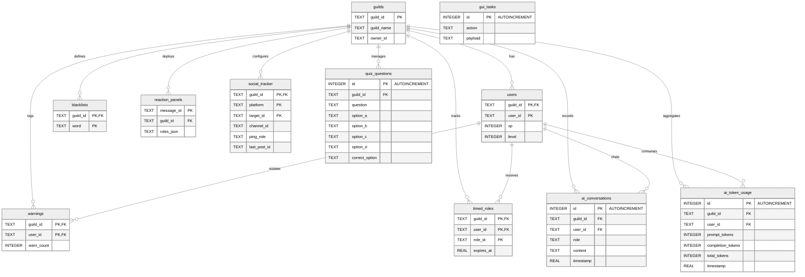
```mermaid


%%{init: {'theme': 'neutral'}}%%


erDiagram


    guilds {


        TEXT guild_id PK


        TEXT guild_name


        TEXT owner_id


    }


    users {


        TEXT guild_id PK, FK


        TEXT user_id PK


        INTEGER xp


        INTEGER level


    }


    warnings {


        TEXT guild_id PK, FK


        TEXT user_id PK, FK


        INTEGER warn_count


    }


    timed_roles {


        TEXT guild_id PK, FK


        TEXT user_id PK, FK


        TEXT role_id PK


        REAL expires_at


    }


    blacklists {


        TEXT guild_id PK, FK


        TEXT word PK


    }


    reaction_panels {


        TEXT message_id PK


        TEXT guild_id FK


        TEXT roles_json


    }


    social_tracker {


        TEXT guild_id PK, FK


        TEXT platform PK


        TEXT target_id PK


        TEXT channel_id


        TEXT ping_role


        TEXT last_post_id


    }


    quiz_questions {


        INTEGER id PK "AUTOINCREMENT"


        TEXT guild_id FK


        TEXT question


        TEXT option_a


        TEXT option_b


        TEXT option_c


        TEXT option_d


        TEXT correct_option


    }


    gui_tasks {


        INTEGER id PK "AUTOINCREMENT"


        TEXT action


        TEXT payload


    }


    ai_conversations {


        INTEGER id PK "AUTOINCREMENT"


        TEXT guild_id FK


        TEXT user_id FK


        TEXT role


        TEXT content


        REAL timestamp


    }


    ai_token_usage {


        INTEGER id PK "AUTOINCREMENT"


        TEXT guild_id FK


        TEXT user_id FK


        INTEGER prompt_tokens


        INTEGER completion_tokens


        INTEGER total_tokens


        REAL timestamp


    }


    guilds ||--o{ users : "has"


    guilds ||--o{ blacklists : "defines"


    guilds ||--o{ reaction_panels : "deploys"


    guilds ||--o{ social_tracker : "configures"


    guilds ||--o{ quiz_questions : "manages"


    guilds ||--o{ warnings : "logs"


    guilds ||--o{ timed_roles : "tracks"


    guilds ||--o{ ai_conversations : "records"


    guilds ||--o{ ai_token_usage : "aggregates"


    users ||--o{ warnings : "violates"


    users ||--o{ timed_roles : "receives"


    users ||--o{ ai_conversations : "chats"


    users ||--o{ ai_token_usage : "consumes"


```


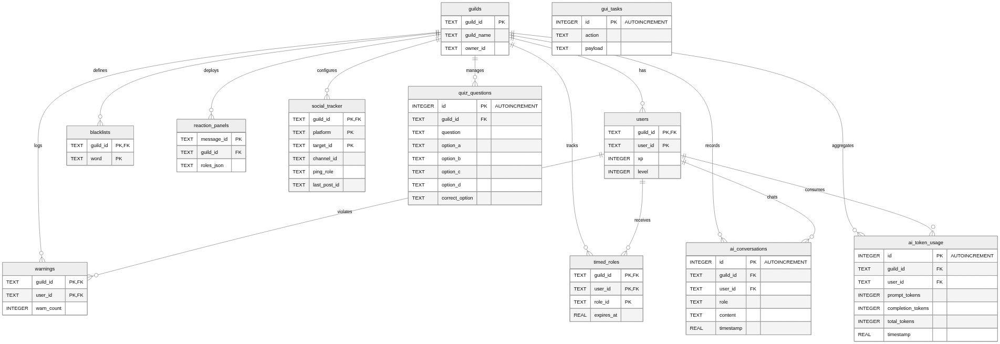


---


*Tài liệu được biên soạn phục vụ báo cáo môn học Công Nghệ Phần Mềm | Năm học 2025-2026*


